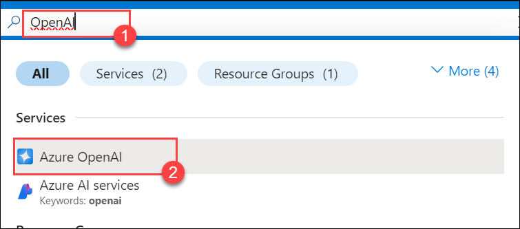
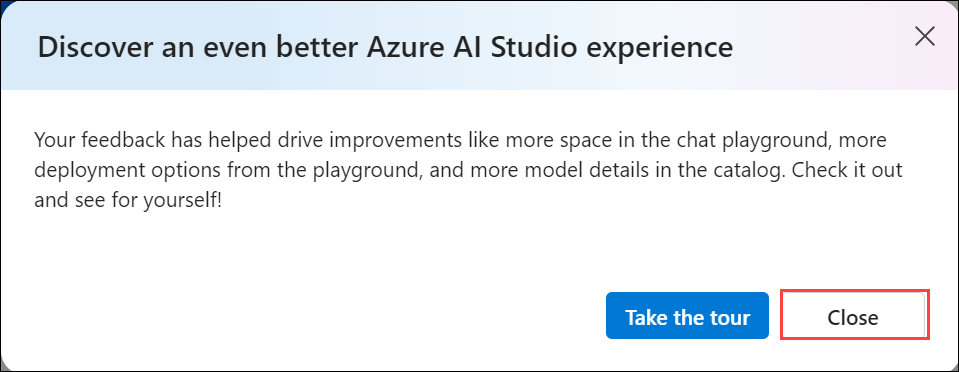
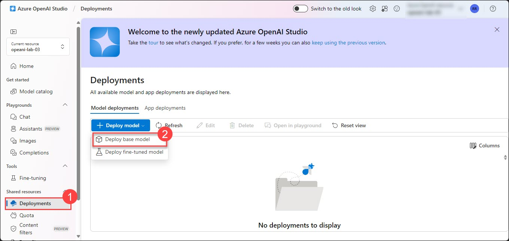
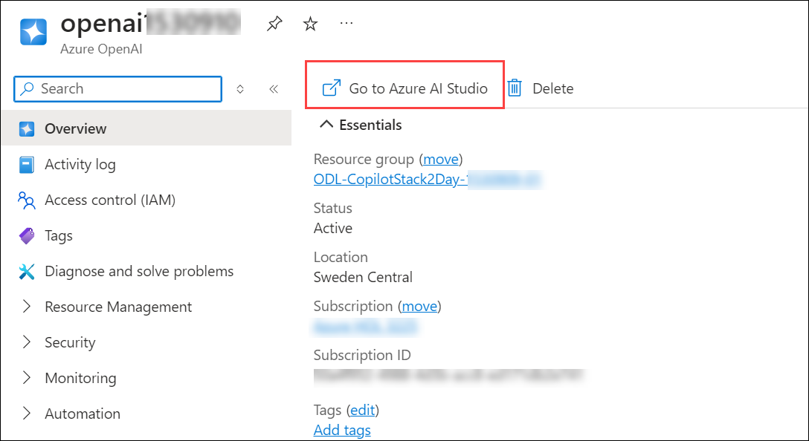
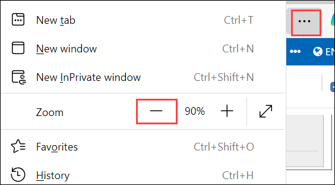

# Lab 1: Getting Started with Building a Chat Application

### Estimated Duration: 30 minutes

Building a chat application involves designing the user interface for seamless communication, implementing backend services for real-time message handling, and integrating with databases for storing chat histories, while ensuring robust security and scalability to handle user interactions effectively.In this lab, you will be setting up the Open AI resource and installing the application locally.

## Lab objectives
In this lab, you will complete the following tasks:

- Task 1: Create an OpenAI resource and model **(READ-ONLY)**
- Task 2: Building a ChatGPT-like application on Streamlit with streaming

### Task 1: Create an OpenAI resource and model **(READ-ONLY)**

**Azure OpenAI**: Azure OpenAI Service is a cloud-based platform that provides access to OpenAI’s powerful language models, including GPT-4, GPT-3.5, Codex, and DALL-E12. This service allows developers to integrate these models into their applications for tasks such as content generation, summarization, semantic search, and natural language to code translation3.

Refer to the link for more information. [Azure OpenAI](https://learn.microsoft.com/en-us/azure/ai-services/openai/overview)

In this task, you will learn to create an Azure OpenAI resource in the Azure portal, configure its settings, and deploy the GPT-4 model in Azure AI Studio. This involves setting up the resource, navigating to Azure AI Studio, and specifying model deployment details.

 > **Note:** This task is **READ-ONLY**. The OpenAI setup is already configured for your environment.

1. In the Azure portal, search for **OpenAI** **(1)** in the top search box, then select **Azure OpenAI** **(2)** under services.

   
   
1. On the Azure AI Services page, select **Azure OpenAI (1)** from the menu on the left, then click **Create (2)**. button to start the process of setting up a new Azure OpenAI resource.

   
   
1. In the **Create Azure OpenAI** pane under the **Basics** tab, Configure the details for your new resource, such as selecting the subscription, resource group, region and other required details.

   | Setting  | Value |
   -----------|---------
   | Subscription | Default (1)|
   | Resource group | **copilot-openai-<inject key="Deployment ID" enableCopy="false"/>** (2) |
   | Region | **East US** (3) |
   | Name   | **copilot-openai-<inject key="Deployment ID" enableCopy="false"/>** (4) |
   | Pricing Tier | **Standard S0** (5) |

   
   
1. Accept the default settings for the Network and Tags tabs without making any changes. Click on **Next** to continue to the next step in the creation process.

1. In the **Review + Submit** pane, ensure that all validation checks have passed. After confirming that there are no errors, click on the **Create** button to finalize and start the deployment of your Azure OpenAI resource.

     > **Note:** This task is **READ-ONLY**. The OpenAI setup is already configured for your environment. Please **DO NOT** click on **Create**. 

   
   
1. The deployment process will take approximately 5 minutes to complete. Once it’s finished, click on **Go to Resource** to access and manage your newly created Azure OpenAI resource.

   
   
1. In the Azure OpenAI resource pane, click on **Go to Azure OpenAI Studio** to navigate to the Azure AI Studio, where you can further configure and use your OpenAI models.

   
   
1. In the prompt titled **Discover an even better Azure AI Studio experience**, click **Close**.

   

1. In the left navigation pane, click on **Deployments (1)**, then click on **+ Deploy model** **(2)**. Select **Deploy base Model** from the options presented.

   

1. In the **Select a model** window, choose **gpt-4 (1)** from the available options, and then click on **Confirm (2)** to proceed with the model selection.

   
   
1. On the **Deploy Model** tab, input the required details such as Deployment name, Model version, Deployment type, Tokens per Minute Rate Limit, and enable dynamic quota. Once all fields are filled, Click on **Deploy** (6).

   | Setting  | Value |
   -----------|---------
   | Deployment name | **copilot-gpt (1)** |
   | Model version | **0613 (Default) (2)** |
   | Deployment type | **Standard (3)** |
   | Tokens per Minute Rate Limit (thousands) | **15K (4)** |
   | Enable dynamic quota | **Enabled (5)** |

     
   
### Task 2: Building a ChatGPT-like application on Streamlit with streaming  

In this task, you will set up an Azure OpenAI resource, deploy models like GPT-4, and integrate the required API keys. After configuring the application with these details, you will run and test a ChatGPT-like app to verify its functionality, demonstrating how to use Azure OpenAI models in a practical application.

1. In the Azure portal, search for **OpenAI** **(1)** in the top search box, then select **Azure OpenAI** **(2)** under services.

   

2. From the **Azure AI Services | Azure OpenAI** pane, select **Copilot-OpenAI-<inject key="Deployment ID" enableCopy="false"/>**.

   

3. In the Azure OpenAI resource pane, click on **Go to Azure AI Studio**. This action will redirect you to the Azure AI Studio interface, where you can manage and interact with your OpenAI models, explore available features, and perform tasks related to model deployment and configuration.

   

4. In the **Azure OpenAI Studio**, select **Deployments (1)** under Management and verify that the **gpt-4** and **text-embedding-ada-002** models are present with the deployment names as **copilot-gpt** and **CompletionModel**. Review that the model's capacity is set to **15K TPM**. Note the **Azure OpenAI deployment names and model names**.
   
   

5. Navigate back to the Azure OpenAI resource on the **Azure portal**, select **Key & Endpoint (1)** from the left menu under **Resource Managemant**, and click on **Show Keys (2)**. Note the **KEY 1 (3)** and **Endpoint (4)**.

   
   
   > **Note**: Steps 5 through 8 demonstrate where to obtain the values used in the configuration.

6. Navigate back to **Azure OpenAI**, select **AI search (1)** from the left menu, and click on **copilot-openai-<inject key="Deployment ID" enableCopy="false"/> (2)**.

   

7. From the Overview tab of Cognitive Search, Note the **URL**.

   

8. From the left menu, select **Key (1)** under **Settings**, Note the **Primary admin key (2)**.

   

9. In the LabVM, open File Explorer, navigate to the below-mentioned path, right-click on the `secrets.env` file, and select open with  **Visual Studio Code**.

   ```
   C:\LabFiles\OpenAIWorkshop\scenarios\incubations\copilot\ChatGPT
   ```

    

10. In the `secrets.env` file, replace the following values. Press **CTRL+S** to save the file.

   | **Variables**                     | **Values**                                                    |
   | --------------------------------- |---------------------------------------------------------------|
   | **AZURE_OPENAI_API_KEY**          | **<inject key="OpenAIKey" enableCopy="true"/>**               |
   | **AZURE_OPENAI_CHAT_DEPLOYMENT**        | Replace the value with your **YOUR_GPT_MODEL** name that is  **copilot-gpt**          |
   | **AZURE_OPENAI_ENDPOINT** | **<inject key="OpenAIEndpoint" enableCopy="true"/>**        |

   

  > **Note :** If you're unable to see the full **Values** section in the table, click on the three dots (ellipsis) in the top right corner of your browser and try reducing the zoom level for better visibility.
   
  

11. Navigate back to File Explorer and open `chatgpt.py` with **Visual Studio Code** to view the code to build a ChatGPT-like app.

     
 
12. Next, click on the **Eclipse Button** at the top of the screen, then select **Terminal** from the dropdown menu and click on **New Terminal** to open a new terminal window.

     


13. Run the following command in the terminal to change the directory:

   ```
   cd C:\LabFiles\OpenAIWorkshop\scenarios\incubations\copilot\ChatGPT
   ```
   
14. To run the application from the command line, enter the following command in the terminal:

   > **Note**: You can enter your email address below to get notifications. If not, please leave this field blank and click on **Enter**.

   ```
   streamlit run chatgpt.py
   ```
   
15. Once the command `streamlit run chatgpt.py` has executed, a demo application will be launched and opened in your web browser, hosted locally on your machine.

   
   
   

16. Explore the app by running a few queries. Congratulations! You've built your own ChatGPT-like application in 50 lines of code.

   

   > **Note**: You may get a different response. please note chatgpt uses LLM and responses may vary everytime.
  
17. Navigate back to **VS Code** and stop the terminal by typing **ctrl + C**.

18. Click the **Next** button located in the bottom right corner of this lab guide to continue with the next exercise.

## Summary

In this lab, you set up an Azure OpenAI resource and model, and built a ChatGPT-like application using Streamlit. You navigated the Azure portal to create and configure your OpenAI resource, verified model deployments, and gathered the necessary API keys and endpoints. After configuring your application with these details, you ran and tested it locally, successfully creating a functional ChatGPT-like app. This process demonstrated the integration of Azure OpenAI models into a practical application, showcasing the steps to build and deploy AI-driven chat functionalities.

### You have successfully completed the lab
