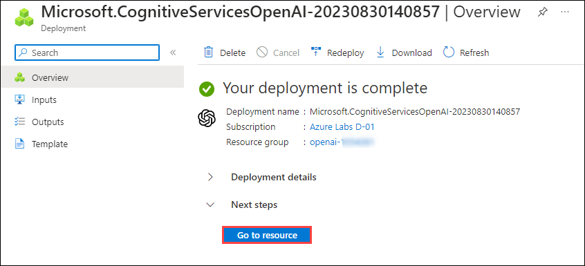
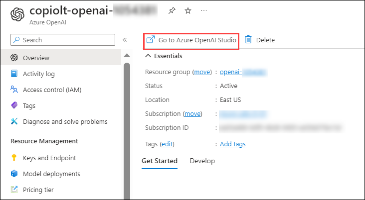
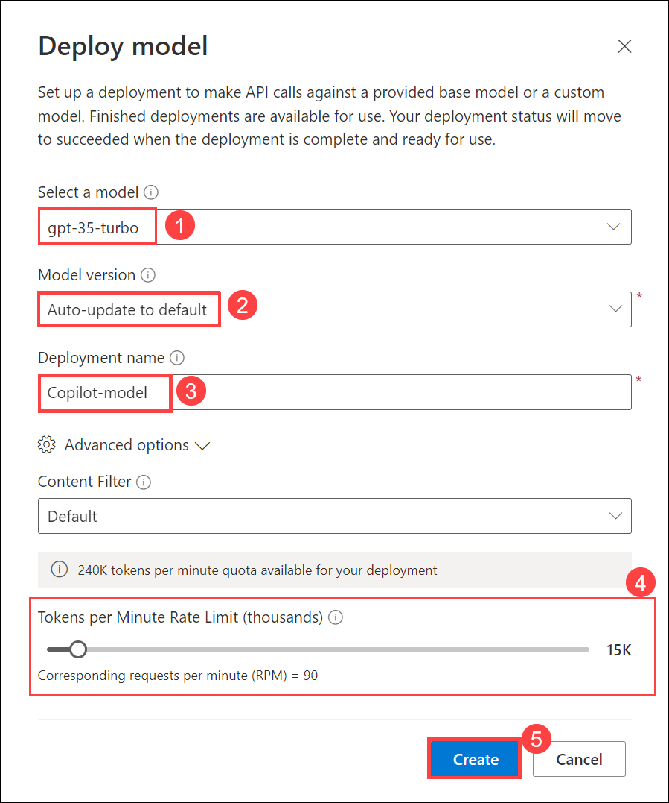
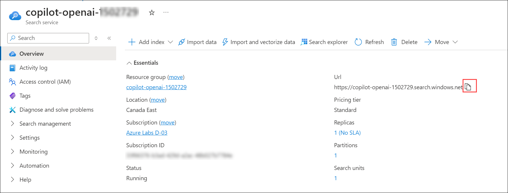

# Lab 1: Getting Started with Building a Chat Application

## Exercise 1: Exercise 1: Open AI Setup and Installation of Applications

In this exercise, you will be setting up the Open AI resource and installing the application locally.

### Task 1: Create an Open AI resource and model (Read-Only)

 > **Note:** This task is **READ-ONLY**. The OpenAI setup is already configured for your environment.

1. In the Azure portal, search for **Azure OpenAI** **(1)** in the top search box, then select **Azure OpenAI** **(2)** under services.

   
   
1. From the **Cognitive Services | Azure OpenAI** pane, click on **Create**.

   
   
1. In the **Create Azure OpenAI** pane under the **Basics** tab, select the default subscription and select the existing **copilot-openai-<inject key="Deployment ID" enableCopy="false"/>** resource group. Select **East US** as Region, enter Name as **copiolt-openai-<inject key="Deployment ID" enableCopy="false"/>** and select **Standard S0** for Pricing  Tier. Click on **Next**.

   
   
1. Leave default settings for the Network and Tags tabs and click on **Next**.

1. Verify that validation has passed in the **Review + Submit** pane and then click on **Create**.

   
   
1. Deployment will take 5 minutes to complete. Once the deployment is successful, click on **Go to Resource**.

   
   
1. In the Azure OpenAI resource pane, select **Go to Azure OpenAI Studio**.

   
   
1. In the Azure OpenAI Studio, click **Deployment (1)** and click **+ Create new deployment (2)**.

   
   
1. On the **Deploy Model** tab, enter the following details and click on **Create (5)**.

   - Select a model: **gpt-35-turbo (1)**
   - Model version: **Auto-update to default (2)**
   - Deployment name: **Copilot-model (3)**
   - Tokens per Minute Rate Limit (thousands): **15K (4)**

   
   
### Task 2: Building a ChatGPT-like application on Streamlit with streaming  

1. Navigate to the OpenAI resource on the **Azure portal**, click on **Go to Azure OpenAI Studio**, and it will navigate to **Azure AI Studio**.

   
      
1. In the **Azure AI Studio**, select **Deployments** under Management and verify that the **gpt-4** and **text-embedding-ada-002** models are present with the deployment names as **copilot-gpt4** and **text-embedding-ada-002**. Review that the capacity of the model is set to **15K TPM**. Copy the OpenAI Model names into the text file for later use.
   
   

1. Select **Key & Endpoint (1)** from the left menu and click on **Show Keys (2)**. Copy the **KEY 1 (3)** and **Endpoint (4)**, and store them in a text file for later use.

   
   
1. Navigate back to **Azure OpenAI**, select **Cognitive search (1)** from the left menu and click on **copilot-openai-<inject key="Deployment ID" enableCopy="false"/> (2)**.

   

1. From the Overview tab of cognitive search, copy the **URL** and paste in a text editor for later use.

   

1. In the LabVM, navigate to Desktop and search for `cmd` in the search box then click on **Command Prompt**.
   
1. Run the below command to change the directory.

   ```
   cd C:\LabFiles\OpenAIWorkshop-Automation\scenarios\incubations\automating_analytics
   ```
   
1. Provide settings for Open AI and Database by creating a ```secrets.env``` file in the root of this folder by running the below command.

   ```
   code secrets.env
   ```
   
1. The Visual Studio code is opened on the desktop. Enter the below code and update the OpenAI Key, Model Name, and Endpoint values that you have copied and stored in the text file earlier.

   ```
   AZURE_OPENAI_API_KEY="********************************" #Replace with the OpenAI Key
   AZURE_OPENAI_GPT4_DEPLOYMENT="NAME_OF_GPT_4_DEPLOYMENT" #Replace with the OpenAI Model Name
   AZURE_OPENAI_CHATGPT_DEPLOYMENT="NAME_OF_CHATGPT_4_DEPLOYMENT" #Replace with the OpenAI Model
   AZURE_OPENAI_ENDPOINT="https://openairesourcename.openai.azure.com/" #Replace with the OpenAI Endpoint
   SQL_ENGINE = "sqlite"
   ```
   
1. After updating values the `secrets.env` file should be as shown in the below screenshot, press **CTRL + S** to save the file.

   
   
1. To run the application from the command line navigate back to Command Prompt and run the below command:

   >**Note**: Here, you can enter your email address below to get notifications. Otherwise, leave this field blank and click on **Enter**.

   ```
   streamlit run app.py
   ```
   
1. Once the execution of `streamlit run app.py` is completed. A locally hosted demo application will be opened in the web browser. 

   
   
   
