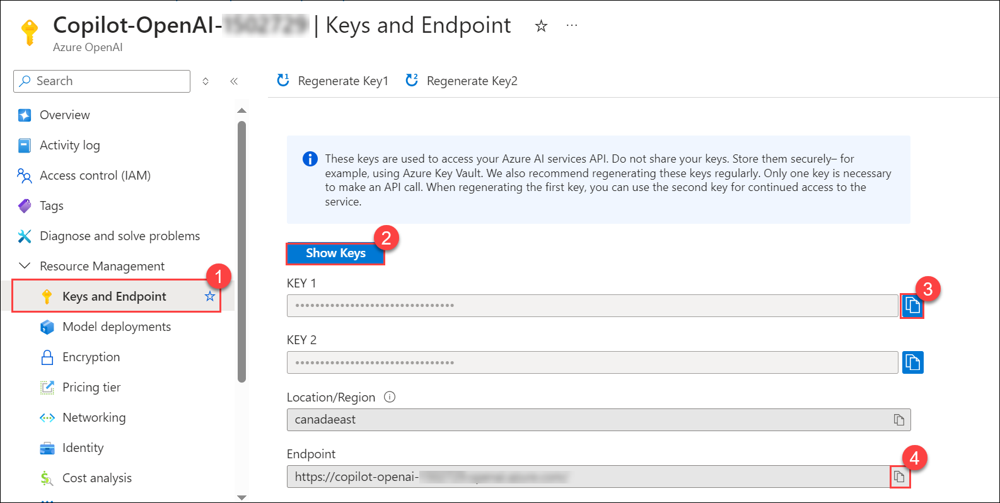

# Lab 01: Getting Started with Building a Chat Application

## Overview

In this lab, you will learn how to build a chat application using Azure OpenAI. The lab involves setting up the necessary OpenAI resources and deploying a ChatGPT-like application using Streamlit. By the end of this lab, you will have a fully functional application that can interact with users through a simple web interface.

## Exercise 1: Open AI Setup and Installation of Applications

In this exercise, you will set up the OpenAI resource and install the necessary applications locally. This exercise is divided into two tasks: setting up the OpenAI resource (read-only) and building a ChatGPT-like application.

### Task 1: Create an OpenAI resource and model **(Read-Only)**

# READ-ONLY

 > **Note:** This task is **READ-ONLY**. The OpenAI setup is already configured for your environment.

In this task, you will review the setup of the OpenAI resource, which has already been configured for your environment. This task is read-only, meaning no changes will be made.

1. In the Azure portal, search for **Azure OpenAI** **(1)** in the top search box, then select **Azure OpenAI** **(2)** under services.

   
   
1. From the **Cognitive Services | Azure OpenAI** pane, click on **+ Create**.

   
   
1. In the **Create Azure OpenAI** pane under the **Basics** tab, select the default subscription and select the existing **copilot-openai-<inject key="Deployment ID" enableCopy="false"/>** resource group. Select **East US** as Region, enter Name as **copilot-openai-<inject key="Deployment ID" enableCopy="false"/>** and select **Standard S0** for Pricing Tier. Click on **Next**.

   
   
1. Leave default settings for the Network and Tags tabs and click on **Next**.

1. Verify that validation has passed in the **Review + Submit** pane, and then click on **Create**.
     > **Note:** This task is **READ-ONLY**. The OpenAI setup is already configured for your environment. Please **DO NOT** click on **Create**. 

   
   
1. Deployment will take 5 minutes to complete. Once the deployment is successful, click on **Go to Resource**.

   
   
1. In the Azure OpenAI resource pane, select **Go to Azure OpenAI Studio**.

   
   
1. In the Azure OpenAI Studio, click **Deployments (1)** and click **+ Create new deployment (2)**.

   
   
1. On the **Deploy Model** tab, enter the following details and click on **Create**.

   - Deployment name: **copilot-gpt**
   - Select a model: **gpt-4**
   - Deployment type: **Standard**
   - Tokens per Minute Rate Limit (thousands): **15K**

     .png "Azure OpenAI")
   
### Task 2: Building a ChatGPT-like application on Streamlit with streaming

In this task, you will configure a locally hosted application that mimics the functionality of ChatGPT. This will involve setting up necessary files, configuring secrets, and running the application. 

1. In the Azure portal, search for **Azure OpenAI** **(1)** in the top search box, then select **Azure OpenAI** **(2)** under services.

   

1. From the **Azure AI Services | Azure OpenAI** pane, select **Copilot-OpenAI-<inject key="Deployment ID" enableCopy="false"/>**.

   

1. In the Azure OpenAI resource pane, select **Go to Azure OpenAI Studio**.

   
      
1. In the **Azure OpenAI Studio**, select **Deployments** under Management and verify that the **gpt-4** model are present with the deployment names as **copilot-gpt**. Review that the model's capacity is set to **15K TPM**. Copy the Azure OpenAI deployment names and model names into the text file for later use.
   
   

1. Navigate back to the Azure OpenAI resource on the **Azure portal**, select **Keys & Endpoint (1)** from the left menu, and click on **Show Keys (2)**. Copy the **KEY 1 (3)** and **Endpoint (4)**, and store them in a text file for later use.

   
   
1. In the LabVM, open File Explorer, navigate to the below-mentioned path, right-click on the `secrets.env` file, and select **Open with Code**.

   ```
   C:\LabFiles\OpenAIWorkshop\scenarios\incubations\copilot\ChatGPT
   ```

    

1. In the `secrets.env` file, replace the following values with the ones you copied earlier. Press **CTRL+S** to save the file.

    - **AZURE_OPENAI_API_KEY**: Replace with your Azure OpenAI Key
    - **AZURE_OPENAI_CHAT_DEPLOYMENT**: Replace with your **GPT** model Azure OpenAI Deployment Name
    - **AZURE_OPENAI_ENDPOINT**: Replace with your Azure OpenAI **Endpoint**

      

1. Navigate back to File Explorer and open `chatgpt.py` with **Visual Studio Code** to view the code to build a ChatGPT-like app.

     
 
1. Next, click on the **Eclipse Button** on the top, then select **Terminal** and click on **New Terminal**.

     

1. Run the below command in the terminal to change the directory.

   ```
   cd C:\LabFiles\OpenAIWorkshop\scenarios\incubations\copilot\ChatGPT
   ```
   
1. To execute the application, run the following command.

   > **Note**: You can enter your email address below to get notifications. If not, please leave this field blank and click on **Enter**.

   ```
   streamlit run chatgpt.py
   ```
   
1. Once the execution of `streamlit run chatgpt.py` is completed, a locally hosted demo application will be opened in the web browser.

   
   
   

1. Explore the app by running a few queries. Congratulations! You've built your own ChatGPT-like app in 50 lines of code.

   

1. Congratulations! You have successfully built your own ChatGPT-like application using Streamlit.

#### Validation

<validation step="21770280-2848-4d6f-ad32-f3bda8d83cc9" />

## Summary

- You reviewed the setup of the OpenAI resource, which was pre-configured for your environment.
- You configured and deployed a ChatGPT-like application using Streamlit.
- You successfully hosted the application locally and tested its functionality by running queries.
