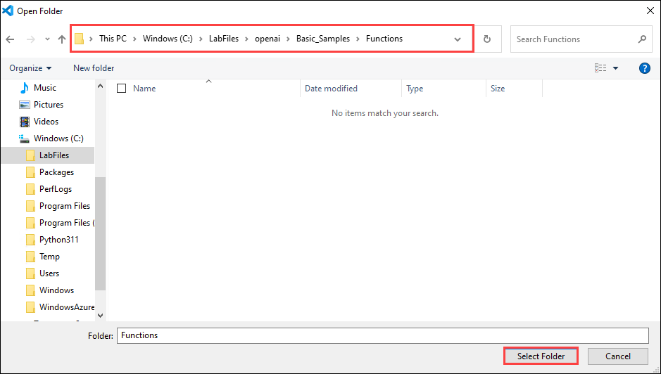

# Lab 2: Understand function calling in Open AI GPT

Over the last couple of years, language models like GPT-3 and GPT-4 have demonstrated their immense power and versatility. These models have been successfully applied in various scenarios, showcasing their capabilities. While these models are already valuable on their own, Azure OpenAI Service now offers an exciting new feature called function calling. With function calling, the latest versions of GPT-3 and GPT-4 can generate structured JSON outputs based on functions specified in the request. This allows developers to integrate the models with other systems and tools, enabling even more possibilities. It's important to note that while the models can generate the function calls, the execution of these calls remains under your control, ensuring that you maintain full control over the process. In this overview, we will explore how function calling works, provide examples of its use cases, and guide you through the steps to leverage this powerful feature in Azure OpenAI Service. 

To know more about Azure Function calling please refer to [Function calling is now available in Azure OpenAI Service](https://techcommunity.microsoft.com/t5/azure-ai-services-blog/function-calling-is-now-available-in-azure-openai-service/ba-p/3879241).


### Task 1: Understand Function calling 

1. Open **Visual Studio Code** from the desktop, next click on **File** and select **Open Folder**.

     

1. Navigate to `C:\LabFiles\openai\Basic_Samples\Functions` and click on **Select folder**. 

     

1.  On the **Do you trust the authors of the files in this folder?** pop-up check the box next to **Trust the authors of all files in the parent folder 'Basic_Samples'**, and select **Yes, I trust the authors**.

     

1. In the **Functions** folder open `config.json` and replace the values following values with the ones you copied earlier. Press **CTRL + S** to save the file.

    - **DEPLOYMENT_ID**: `Replace the value with the gpt-model name`
    - **OPENAI_API_BASE**: `Replace the value with OpenAI Endpoint`
    - **SEARCH_SERVICE_ENDPOINT**: `Replace the value with Search Service Endpoint`

     

1. Next, click on the **Eclipse Button** on the top, then select **Terminal** and click on **New Terminal**.

     

1. In the new terminal run the following command to install the required modules.

    ```
    pip install -r requirements.txt
    ```

1. Once the requirements are installed close the terminal.

1. Next, open the `working_with_functions.ipynb` file from the left menu.

     

1. Click on the **Run (1)** button of the first cell, once the pop-up `Install/Enable suggested extensions Python +Jupyter` appears click on it to install the Python and Jupyter extensions. 

     

1. Next, on the **Choose a Kernel source** pop-up select **Python Environment** this will initiate the installation of extension.

    

1. Execute the notebook cell by cell (using either Ctrl + Enter to stay on the same cell or Shift + Enter to advance to the next cell) and observe the results of each cell execution.

   

   >**Note:** Please ensure to run the notebook end to end and observe the output for each cell. 
