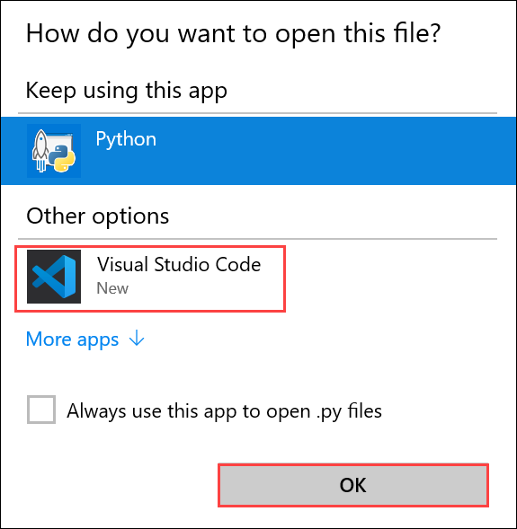
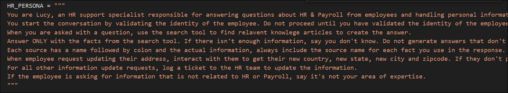
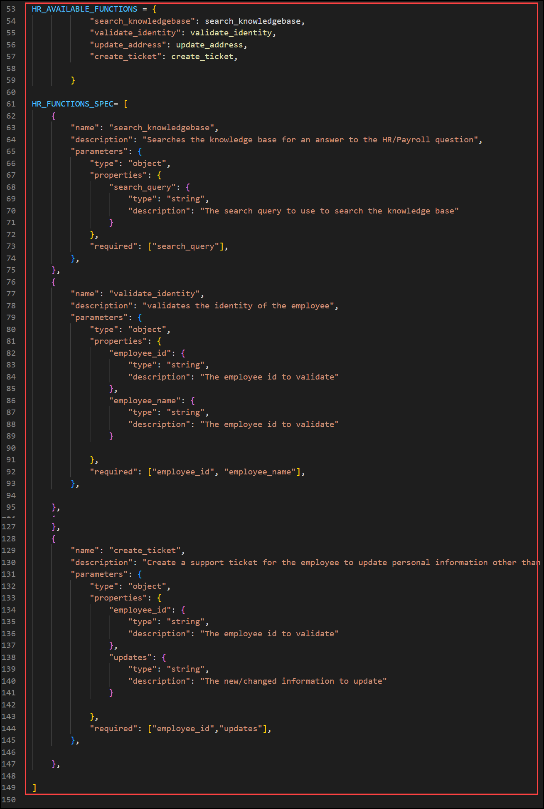
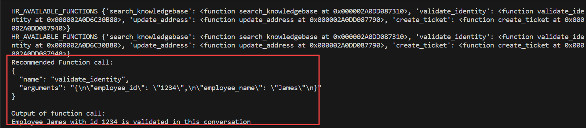

# Lab 2: Understand function calling in Open AI GPT

Over the last couple of years, language models like GPT-3 and GPT-4 have demonstrated their immense power and versatility. These models have been successfully applied in various scenarios, showcasing their capabilities. While these models are already valuable on their own, Azure OpenAI Service now offers an exciting new feature called function calling. With function calling, the latest versions of GPT-3 and GPT-4 can generate structured JSON outputs based on functions specified in the request. This allows developers to integrate the models with other systems and tools, enabling even more possibilities. It's important to note that while the models can generate the function calls, the execution of these calls remains under your control, ensuring that you maintain full control over the process. In this overview, we will explore how function calling works, provide examples of its use cases, and guide you through the steps to leverage this powerful feature in Azure OpenAI Service. 

To know more about Azure Function calling please refer to [Function calling is now available in Azure OpenAI Service](https://techcommunity.microsoft.com/t5/azure-ai-services-blog/function-calling-is-now-available-in-azure-openai-service/ba-p/3879241).

### Task 1: Understand Function calling (Read-Only)

1. In the LabVM, open File Explorer navigate to the `C:\Labfiles\OpenAIWorkshop\scenarios\incubations\copilot\employee_support` path, open hr_copilot_utils.py, and select Open with  **Visual Studio Code** click on **OK**. Take a look at the code to see how function calling works.

    

2. The code snippet here provides a persona description for a **HR support specialist** named Lucy. Lucy's role is to assist employees with HR and Payroll-related questions and handle personal information updates. 

    
   
3. In the code snippet, you can see how the different function specifications are defined, each specification will help find relevant answers to HR and Payroll questions.

    

4. Once the application runs you will observe how the function is called and details are fetched.

    

 
  **Here is the flow of function calling:**
  
  - **Check If Model Wants to Use a Function**: This step involves the user (or model) initiating a conversation with the LLM and expressing a desire to perform a specific function or task.
  
  - **Get Function Names and Parameters from Model**: Once the desire to perform a function is expressed, the LLM would need to understand which function is requested and what parameters or information are required to execute that function. The user (or model) provides this information.
  
  - **Execute Function**: With the function name and parameters in hand, the LLM performs the requested function. The complexity of the function can vary widely, from simple calculations to more complex tasks like searching for information, generating content, or interacting with external systems.
  
  - **Get Function Output & Augment It**: After executing the function, the LLM obtains the output or result of that function. Depending on the nature of the function and the user's (or model's) instructions, the LLM might augment or modify the output in some way. This augmentation could involve formatting, summarizing, or enhancing the output.
  
  - **Send Augmented Output to LLM**: The augmented output is then sent as input to the language model (LLM) for further processing or interaction. This step may involve providing additional context or asking follow-up questions based on the output of the function.
  
  - **Get LLM's Response**: The LLM receives the augmented output as input and generates a response based on that input. The response can be in the form of text or other relevant information. The LLM's response can include explanations, clarifications, or further actions based on the function's output.

