# Lab 2: Understand function calling in Open AI GPT

### Estimated Duration: 30 minutes

This lab focuses on the Function Calling feature in Azure OpenAI, an advanced capability that enables modern lifecycle-supported models such as GPT-4.1 and GPT-5 family models to generate structured JSON outputs mapped to predefined functions. Unlike legacy GPT-3 and earlier GPT-4 models, current Azure OpenAI deployments are built around forward-compatible model versions designed for enterprise-grade scalability and long-term support.

By integrating these models with external systems, you can gain enhanced control, reliability, and flexibility in automation and data processing tasks. Function calling allows the model to intelligently determine when to invoke backend services and provide validated arguments for execution, enabling seamless integration with APIs, databases, and business workflows.

Throughout this lab, you will explore the setup, configuration, and practical implementation of function calling within the Azure OpenAI environment, empowering you to design structured, production-ready AI applications aligned with Microsoft’s current model lifecycle strategy. 

## Lab objectives

You will be able to complete the following tasks:

- Task 1: Understand Function calling
  
### Task 1: Understand Function calling

In this task, you will configure and test a project in Visual Studio Code by updating necessary settings, installing dependencies, and executing a Jupyter notebook. This ensures that the project is correctly set up and functioning as expected with the integrated APIs and modules.

**Function calling**: Function calling allows you to connect models like gpt-4o to external tools and systems. This is useful for many things such as empowering AI assistants with capabilities, or building deep integrations between your applications and the models.

#### Refer to the links for more information.
 
 - [Function Calling](https://platform.openai.com/docs/guides/function-calling)
 - [Function Calling with Azure OpenAI Service](https://learn.microsoft.com/en-us/azure/ai-services/openai/how-to/function-calling)
 - [Function calling is now available in Azure OpenAI Service](https://techcommunity.microsoft.com/t5/azure-ai-services-blog/function-calling-is-now-available-in-azure-openai-service/ba-p/3879241)

1. Open **Visual Studio Code** from the desktop and then click on **File** and select **Open Folder**.

    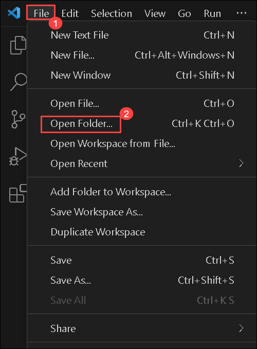 

2. Navigate to the below-mentioned path and click on **Select folder**. 

    ```
    C:\LabFiles\openai\Basic_Samples\Functions
    ```

   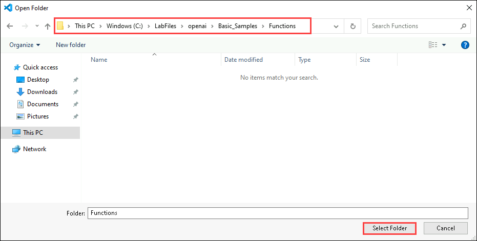 

4. On the **Do you trust the authors of the files in this folder?** pop-up check the box next to **Trust the authors of all files in the parent folder 'Basic_Samples'**, and select **Yes, I trust the authors**.

    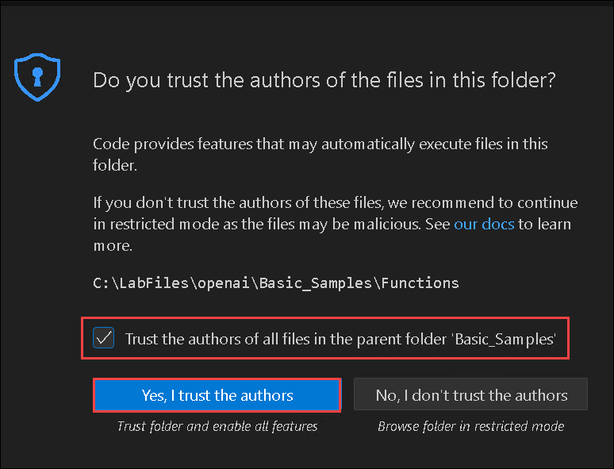 

5. In the **Functions** folder, open `config.json` and replace the following values with the ones mentioned below. Next, press **CTRL + S** to save the file.

    >**Note:** You can also get the **Azure OpenAI Key** and **Endpoint** from **Azure OpenAI resource → Keys & Endpoint**, and the **Search Service URL** and **Primary admin key** from your **AI Search resource → Overview and Settings → Keys** in the Azure portal.

   | **Variables**                | **Values**                                                    |
   | ---------------------------- |---------------------------------------------------------------|
   | **DEPLOYMENT_NAME**          |  **copilot-gpt**              |
   | **OPENAI_API_BASE**          | **<inject key="OpenAIEndpoint" enableCopy="true"/>**          |
   | **OPENAI_API_KEY**           | **<inject key="OpenAIKey" enableCopy="true"/>**               |
   | **SEARCH_SERVICE_ENDPOINT**  | **<inject key="SearchServiceuri" enableCopy="true"/>**        |
   | **SEARCH_ADMIN_KEY**         | **<inject key="SearchAPIkey" enableCopy="true"/>**            |
   
   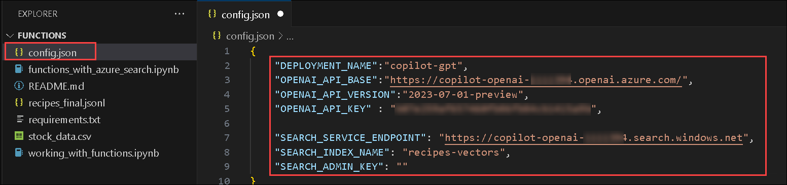 

7. Next, click on the **Eclipse Button (1)** at the top of the screen, then select **Terminal (2)** from the dropdown menu, and click on **New Terminal (3)** to open a new terminal window.

    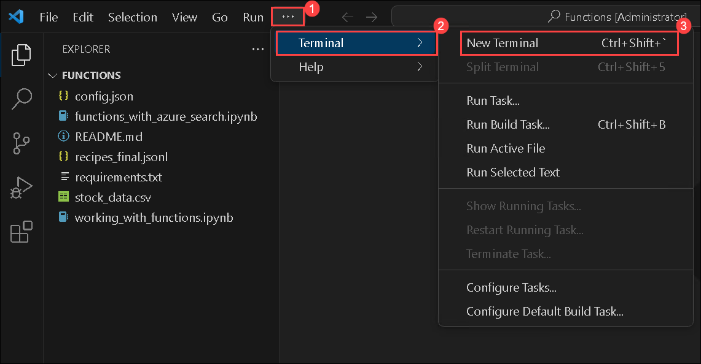

8. In the new terminal, run the following command to install the required modules:

    ```
    pip install -r requirements.txt
    ```

9. Once the required modules are installed, close the terminal.

10. Open the `working_with_functions.ipynb` file from the left menu.

    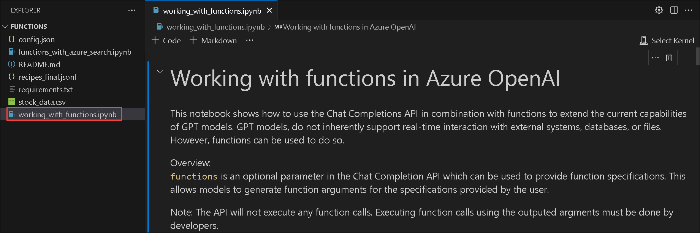 

11. Click on the **Run (1)** button in the first cell. Once the pop-up **Install/Enable suggested extensions Python + Jupyter** appears, click on it to install the Python and Jupyter extensions. 

    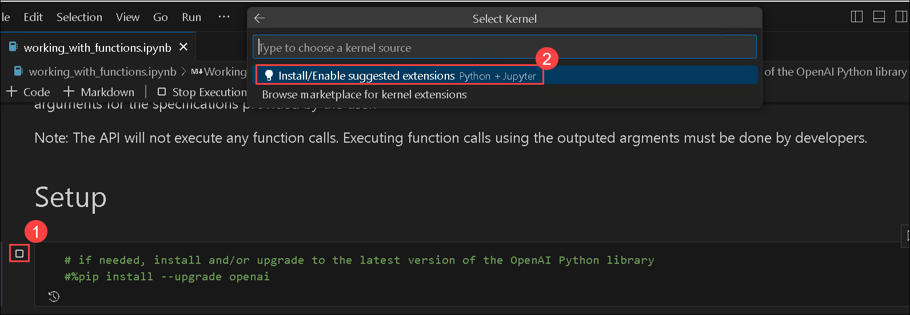 

12. Next, on the **Choose a Kernel source** pop-up, select **Python Environments**. This will initiate the installation of the extension.

       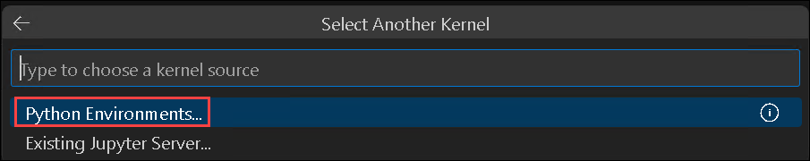 

13. Next, on the **Select a Python Environment** pop-up, select **Python 3.12.10**. This will set the Python Environment. 

    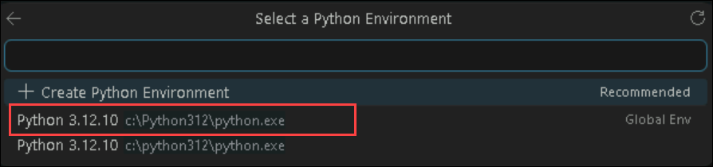 

    > **Note**: If prompt **Runnning cells with 'c:\pytjon312\python.exe' requires the ipykernel package.** then click on **Install**.

    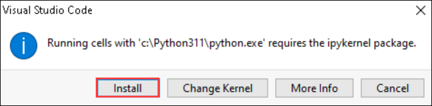

14. Execute the notebook cell by cell (using either `Ctrl + Enter` to stay on the same cell or `Shift + Enter` to advance to the next cell) and observe the results of each cell execution.

    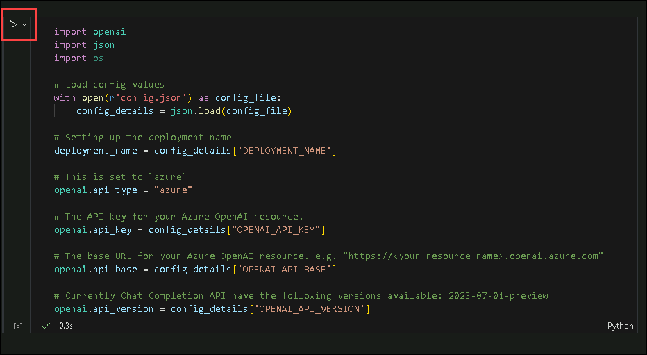

    > **Note:** Please ensure to run the notebook end to end and observe the output for each cell. 

### Summary

In this lab, you have understood Function calling and learned how to set up a Visual Studio Code environment, configure the necessary files for your project, install required modules, and execute a Jupyter notebook. You’ve also gained experience with handling Python environments, using terminal commands, and verifying code execution in Jupyter notebooks.

