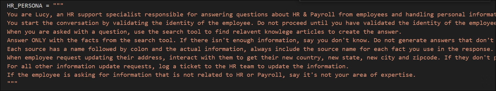
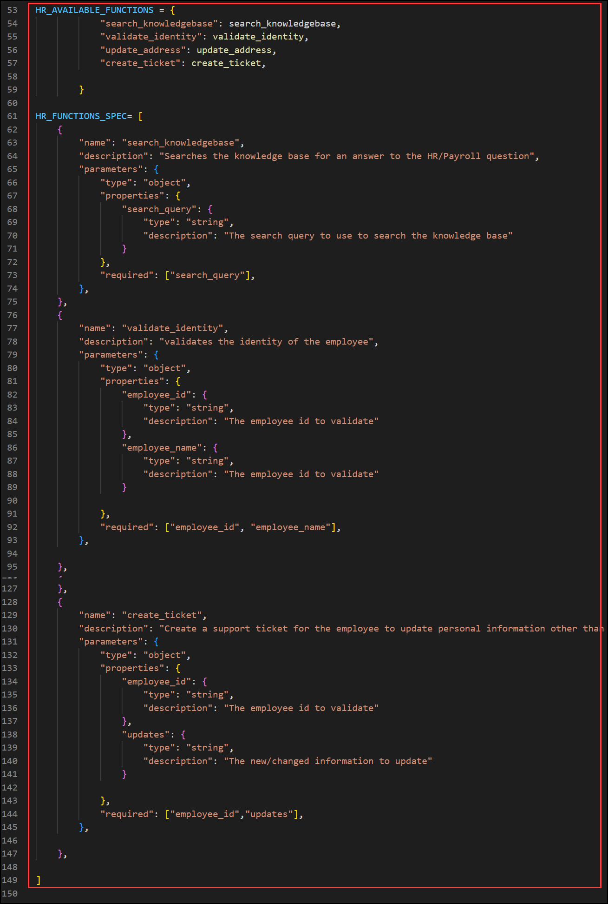
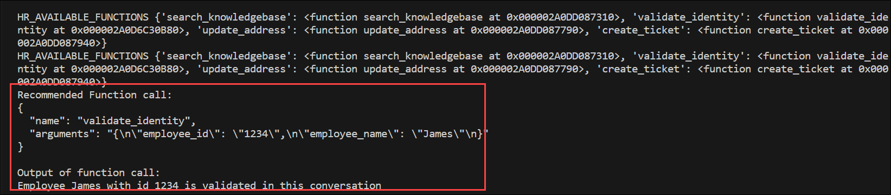

# Lab 2: Understand Function Calling in Azure OpenAI

Over the last few years, large language models have evolved significantly, with modern Azure OpenAI deployments now centered around lifecycle-supported models such as GPT-4.1, GPT-4.1-mini, and the GPT-5 family. These models provide enhanced reasoning, structured output capabilities, and enterprise-grade scalability compared to legacy GPT-3 and earlier GPT-4 versions.

Azure OpenAI includes a powerful feature called **Function Calling**, which enables supported GPT-4.1 and GPT-5 class models to generate structured JSON outputs based on functions defined in the request. Instead of returning only conversational text, the model can determine when a function should be invoked and return properly formatted arguments for execution.

This capability allows developers to seamlessly integrate AI models with external systems such as APIs, databases, and enterprise services. While the model can suggest function calls and generate structured parameters, the execution logic remains fully under your control. This ensures security, compliance, and governance within enterprise applications.

In this lab, you will explore how function calling works, review practical use cases, and implement structured tool integration using Azure OpenAI. By the end, you will understand how to leverage function calling to build intelligent, production-ready AI solutions aligned with Azure’s current model lifecycle strategy.

To learn more about Azure Function Calling, refer to the official documentation:  
[Function calling in Azure OpenAI Service](https://learn.microsoft.com/azure/ai-services/openai/how-to/function-calling)
### Task 1: Understand Function calling (Read-Only)

1. In the LabVM, open File Explorer, navigate to the `C:\Labfiles\OpenAIWorkshop\scenarios\incubations\copilot\employee_support` path, open **hr_copilot_utils.py**, and select Open with  **Visual Studio Code** click on **OK**. Take a look at the code to see how function calling works.

    

2. The code snippet here provides a persona description for a **HR support specialist** named Lucy. Lucy's role is to assist employees with HR and Payroll-related questions and handle personal information updates. 

    
   
3. In the code snippet, you can see how the different function specifications are defined, each specification will help find relevant answers to HR and Payroll questions.

    

4. Once the application runs you will observe how the function is called and details are fetched.

    

 
  **Here is the flow of function calling:**
  
  - **Check If Model Wants to Use a Function**: This step involves the user (or model) initiating a conversation with the LLM and expressing a desire to perform a specific function or task.
  
  - **Get Function Names and Parameters from Model**: Once the desire to perform a function is expressed, the LLM would need to understand which function is requested and what parameters or information are required to execute that function. The user (or model) provides this information.
  
  - **Execute Function**: With the function name and parameters in hand, the LLM performs the requested function. The complexity of the function can vary widely, from simple calculations to more complex tasks like searching for information, generating content, or interacting with external systems.
  
  - **Get Function Output & Augment It**: After executing the function, the LLM obtains the output or result of that function. Depending on the nature of the function and the user's (or model's) instructions, the LLM might augment or modify the output in some way. This augmentation could involve formatting, summarizing, or enhancing the output.
  
  - **Send Augmented Output to LLM**: The augmented output is then sent as input to the language model (LLM) for further processing or interaction. This step may involve providing additional context or asking follow-up questions based on the output of the function.
  
  - **Get LLM's Response**: The LLM receives the augmented output as input and generates a response based on that input. The response can be in the form of text or other relevant information. The LLM's response can include explanations, clarifications, or further actions based on the function's output.

