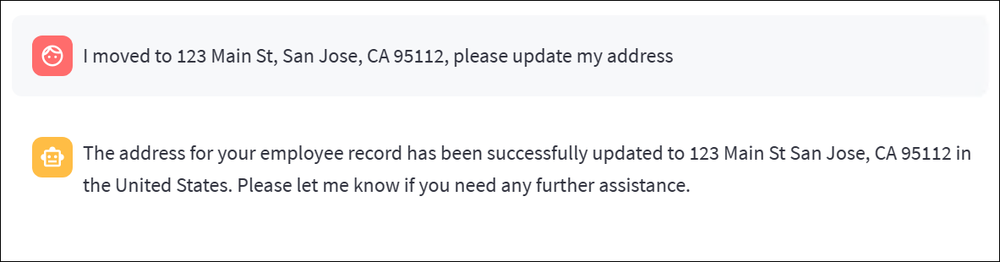
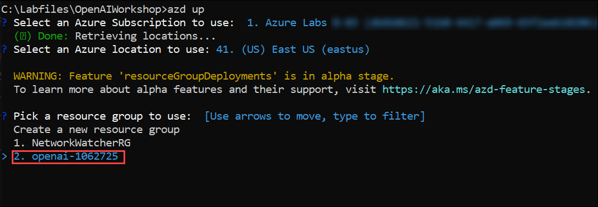
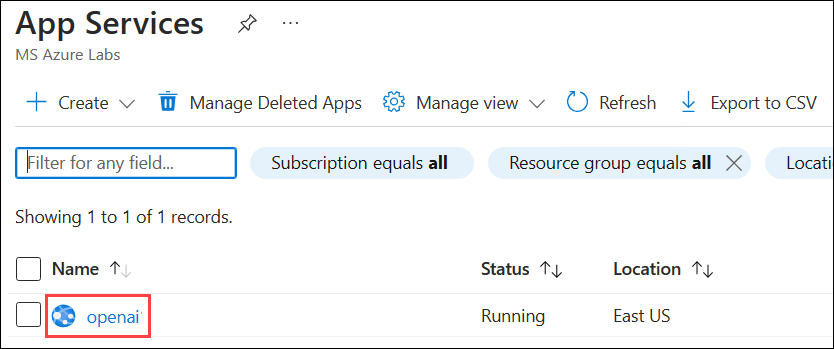
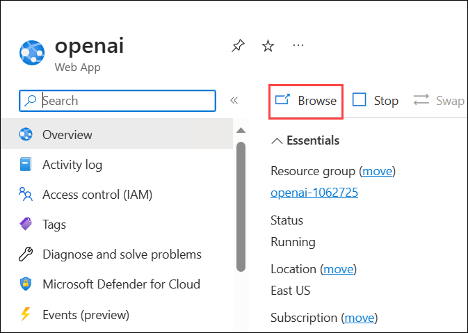

# Lab 3 : Deploy and Run HR/Payroll Copilot Application 

   

**Application Platform:**
The solution is built on top of streamlit application platform. Streamlit allows easy creation of interactive Python application with ability to render rich & responsive UI such as Chat UI and Python data visualization.

**Smart Agent:At the heart of the solution is the python object Smart_Agent. The agent has following components:**

  - **Goals/Tasks:** Smart_Agent is given a persona and instructions to follow to achieve certain goals, for example for HR Copilot it is about helping answer HR/Payroll question and update employee's personal information. This is done using instructions specified to the system message.

  - **NLP interacation & tool execution:** For the abilility to use multiple tools and functions to accomplish business tasks, function calling capability of 0613 version is utilized to intelligently select the right function (validate identity/search knowlege base/update address/create ticket) based on the agent's judgement of what need to be done. The agent is also able to engage with users following the instruction/goals defined in the system message.

  - **Memory:** The agent maintain a memomory of the conversation history. The memory is backed by Streamlit's session state.
  - **LLM:** The agent is linked to a 0613 GPT-4 model to power its intelligence.

    
### Task 1: Build your own HR/Payroll copilot locally

1. In the LabVM, open File Explorer naviagte to the `C:\Labfiles\OpenAIWorkshop\scenarios\incubations\copilot` path, right click on `secrets.env` filr and select Open with  **Visual Studio Code**.

    

1. You will see the Visual Studio code is opened in the desktop. Edit the below code and update the OpenAI Key, Model Names, Endpoint and cognitive search endpoint values which you have copied and stored in text file earlier.

   ```
    AZURE_OPENAI_API_KEY="********************************" #Replace with the OpenAI Key  
    AZURE_OPENAI_ENDPOINT="https://openairesourcename.openai.azure.com/" #Replace with the OpenAI Endpoint
    AZURE_OPENAI_EMB_DEPLOYMENT="gptchat" #Replace with name of your embedding model deployment
    AZURE_OPENAI_CHAT_DEPLOYMENT="gpt" #Replace with name of your Open AI Chat Deployment
    AZURE_SEARCH_SERVICE_ENDPOINT="https://YOUR_SEARCH_SERVICE.search.windows.net" #Replace with your Search Service endpoint
   ```

5.  After updating values the `secrets.env` file should be as shown in the below screenshot, press **CTRL + S** to save the file.

    

6. To run the application from the command line navigate back to Command Prompt and run the below command:

   >**Note**: Here, you can enter your email address below to get notifications. Otherwise, leave this field blank and click on **Enter**.

   ```
   cd C:\Labfiles\OpenAIWorkshop\scenarios\incubations\copilot\employee_support
   streamlit run hr_copilot.py
   ```

7. Once the execution of `streamlit run app.py` is completed. A locally hosted HR Copliot appliation will be opened in the web browser. 

   
   

8. Run the following query to validate the identity of the employee.

   ```
   Jhon 1234
   ```

   

9. Enter an example question such as `When will I receive W2 form?`. The questions are answered by the Copilot by searching a knowledge base and providing the answer.

   

10. Copilot also can help update employee information like address update. For other information update requests, the Copilot will log a ticket to the HR team to update the information. Enter 'I moved to 123 Main St, San Jose, CA 95112, please update my address' in the HR Copilot app.

    

### Task 2: Deploy HR/Payroll copilot application to Azure

1. In the LabVM, navigate to Desktop and search for `cmd` in the search box then click on **Command Prompt**.

1. Run the below command to change the directory.

   ```bash
   cd C:\LabFiles\OpenAIWorkshop
   ```

1. Run the below command to **Authenticate with Azure**. It will redirect to Azure authorize website, select your account.

   ```bash
   azd auth login
   ```

1. Run the below command to setup the resource group deployment and **Create a new environment**. Make sure to replace `{DeploymentId}` with **<inject key="Deployment ID" enableCopy="true"/>** in the below command.

   ```bash
   azd config set alpha.resourceGroupDeployments on
   ```
   
   ```bash
   azd env new copilot-{DeploymentId}
   ```

1. Run the below command to Provision Azure resources, and deploy your project with a single command.

   ```bash
   azd up
   ```
1. Please select your Azure Subscription to use, enter `1` and click on **Enter** button.

   


1. Please select an Azure location to use, select the location as **<inject key="Region" enableCopy="false"/>** location, and click on **Enter** button. You can change the location using up and down arrow.

    


1.  Next, select **openai-<inject key="Deployment ID" enableCopy="False"/>** resource group and hit **ENTER**.

    

1. Once the deployment succeeded, you will see the following message **SUCCESS: Your application was provisioned and deployed to Azure**. The deployment might take 5 - 10 minutes. It is producing a web package file, then creating the resource and publishing the package to the app service.


1. Naviagte back to the Azure portal, search and select **App service**. Select the available web app which you have deployed in the previous step.

    

1. Next, click on **Browse** to open your Web application.

    
