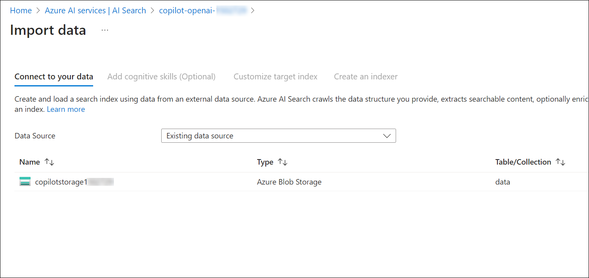

# Lab 3: Understand HR Copilot Demo Application

   

**Smart Agent: At the heart of the solution is the Python object Smart_Agent. The agent has the following components:**

  - **Goals/Tasks:** Smart_Agent is given a persona and instructions to follow to achieve certain goals; for example, HR Copilot is about helping answer HR/Payroll questions and update employees' personal information. This is done using instructions specified in the system message.

  - **NLP interaction and tool execution:** For the ability to use multiple tools and functions to accomplish business tasks, the function calling capability of the 0613 version is utilized to intelligently select the right function (validate identity, search the knowledge base, update address, create ticket) based on the agent's judgment of what needs to be done. The agent is also able to engage with users by following the instructions and goals defined in the system message.

  - **Memory:** The agent maintains a memory of the conversation history. The memory is backed by Streamlit's session state.
  - **LLM:** The agent is linked to a 0613 GPT-4 model to power its intelligence.

    
### Task 1: Build your own HR/Payroll copilot locally

1. In the LabVM, open File Explorer, navigate to the below-mentioned path, right-click on the `secrets.env` file, and select open with  **Visual Studio Code**.

   ```
   C:\Labfiles\OpenAIWorkshop\scenarios\incubations\copilot
   ```

    

1. Navigate back to the **Azure portal** and search for **AI Search (1)** in the top search box, then select **AI Search (2)** under services.

   
   
1. From the **Azure AI Services | AI Search** pane, select **copilot-openAI-<inject key="Deployment ID" enableCopy="false"/>**.

   

1. On the Overview page, copy the **Cognitive Search Endpoint** and store it in a text file for later use.

   

1. Click on **Keys (1)** from the left menu, copy the **Primary Admin Key (2)** and store it in a text file for later use.

   
   
1. The Visual Studio code is opened on the desktop. Edit the below code and update the **Azure OpenAI Key**, **Embedding Model name and GPT Deployment name**, **Azure OpenAI Endpoint**, **Cognitive Search Endpoint**,and **AZURE_SEARCH_ADMIN_KEY** values that you have copied and stored in the text file earlier.

   ```
      AZURE_OPENAI_API_KEY:'YOUR_OPENAI_KEY' //#Replace it with the OpenAI key.
      AZURE_OPENAI_ENDPOINT:'YOUR_OPENAI_ENDPOINT' //#Replace with the OpenAI Endpoint
      AZURE_OPENAI_EMB_DEPLOYMENT:'YOUR_EMBEDDING_MODEL' //#Replace with the name of your embedding model deployment.
      AZURE_OPENAI_CHAT_DEPLOYMENT:'YOUR_GPT_MODEL' //#Replace with the name of your Open AI Chat Deployment.
      AZURE_SEARCH_SERVICE_ENDPOINT:'YOUR_SEARCH_SERVICE_ENDPOINT' //#Replace with Search Service Endpoint.
      AZURE_SEARCH_ADMIN_KEY: "YOUR_SEARCH_SERVICE_ADMIN_KEY" //#Replace the value with the Primary admin key
   ```

1. After updating values, the `secrets.env` file should be as shown in the below screenshot. Next, Click **File->Save** to save the file.

    

1. To run the application from the command line, navigate to Command Prompt and run the below commands:

   > **Note**: Here, you can enter your email address below to get notifications. Otherwise, leave this field blank and click on **Enter**.

   ```
   cd C:\Labfiles\OpenAIWorkshop\scenarios\incubations\copilot\employee_support
   ```
   ```
   pip install -r requirments.txt
   ```
   ```
   streamlit run hr_copilot.py
   ```

1. Once the execution of `streamlit run hr_copilot.py` is completed, a locally hosted HR Copliot application will be opened in the web browser. 

   

   

1. Run the following query to validate the identity of the employee:

   ```
   John 1234
   ```

   

   >**Note**: Copilot Chat may not respond with the exact output as shown in the screenshots. Following are the examples of what you'll most likely to see in this exercise, but the response may vary.

1. Enter an example question such as `Can you explain what are deducted from my paycheck?`. The questions are answered by the Copilot by searching a knowledge base.

   


1. Copilot can help update employee information, like address updates. For other information update requests, Copilot will log a ticket to the HR team to update the information. Enter `I moved to 123 Main St., San Jose, CA 95112, please update my address` in the HR Copilot app.

    

1. Navigate back to **CMD** and stop the terminal by typing **ctrl + C**.

### Task 2: Create AI Search Indexers with Documents.

1. In the **Azure Portal**, search and select **Storage accounts**. 

    

2. From the **Storage account** page, select **copilotstorage<inject key="Deployment ID" enableCopy="false"/>**.

    

3. From the left menu, select **Access keys** under **Security + networking** section. Copy the **Connection string** and store it in a text file for later use.

    

4. Next, navigate to **Azure AI services**, select **AI search (1)** from the left menu, and click on **copilot-openai-<inject key="Deployment ID" enableCopy="false"/> (2)**.

   

5. On the **Overview (1)** page, click on **Import data (2)**.

    

6.  Select **Azure Blob storage** as the **Data source**.

    

7. On the **Connect to your data** tab, provide the following details and click on **Next: Add cognitive skills (Optional) (7)**.

   | Settings| value|
   |---|---|
   |Data source name| **copilotstorage<inject key="Deployment ID" enableCopy="false"/>** **(1)**|
   |Data to extract| **Content and metadata** **(2)**|
   |Parsing mode| **JSON array** **(3)**|
   |Connection string | **YOUR_STORAGE_ACCOUNT_CONNECTIONSTRING (4)**|
   |Container name| **data (5)**|
   |Blob folder| **data (6)**|

   

8. On the **Add cognitive skills (optional)** tab, leave the default and click on **Skip to: Customize target index**.

9. Next, on the **Customize target index**  tab, enter the **Index name** as **payroll-hr (1)**. Set the values as provided in the below image (make sure you select `Collection(Edm.Single)` as the type for the content vector field).

   

10. Next, on the **contentVector** field, click on the **Ellipsis** button in the right corner and select **Configure vector field**.

      

11. On the **Configure vector field** tab, set the **Dimensions** property to `1536` **(1)** and Click on **Create** **(2)** under No vector search profiles.

      

12. On the **Vector profile** tab, Click on **Create** under No algorithm configurations.

      

13. On the **Vector algorithm** tab, leave the default and click on **Save**.

      

14. On the **Vector profile** tab, select the algorithm created in the previous step and Click on **Create** under No vectorizers.

      

15. On the **Vector algorithm** tab, leave the default and select the Azure OpenAI service as **Copilot-OpenAI-<inject key="Deployment ID" enableCopy="false"/>** and model deployment as **text-embedding-ada-002** . Click on **Save**.

      

16. On the **Vector profile** tab, select the Vectorizers created in the previous step and Click on **Save**.

      

17. On the **Configure vector field** tab, keep the **Dimensions** property to `1536` and **Vector profile** created in previous step and Click on **Save**. Click on **Next: Create an indexer**.

      
    
18. Enter the **Indexer name** as **payroll-hr**, and click on **Submit**.

      

19. From the **Overview (1)** page, click on **Import data (2)** again.

       

20. On the **Connect to your data** tab, select the existing data source and select the storage account then, click **Next: Add cognitive skills (optional)**.

      

21. On the **Add cognitive skills (optional)** tab leave the default and click on **Skip to: Customize target index**.

22. Next, on the **Customize target index**  tab, enter the **Index name** as **payroll-hr-cache (1)**. Click on **+ Add field**, and create **id, search_query, search_query_vector, gpt_response** fields with the configurations as provided in the below image (make sure you select `Collection(Edm.Single)` as the type for the search_query_vector field).

      

23. In the **search_query_vector** field, click on the **Ellipsis** button in the right corner and select **Configure vector field**.

      

24. On the **Configure vector field** tab, set the **Dimensions** property to `1536` **(1)** and Click on **Create** **(2)** under No vector search profiles.

      

25. On the **Vector profile** tab, Click on **Create** under No algorithm configurations.

      

26. On the **Vector algorithm** tab, leave the default and click on **Save**.

      

27. On the **Vector profile** tab, select the algorithm created in the previous step and Click on **Create** under No vectorizers.

      

28. On the **Vector algorithm** tab, leave the default and select the Azure OpenAI service as **Copilot-OpenAI-<inject key="Deployment ID" enableCopy="false"/>** and model deployment as **text-embedding-ada-002** . Click on **Save**.

      

29. On the **Vector profile** tab, select the Vectorizers created in the previous step and Click on **Save**.

      

30. On the **Configure vector field** tab, keep the **Dimensions** property to `1536` and **Vector profile** created in previous step and Click on **Save**. Click on **Next: Create an indexer**.

      

31. Enter the **Indexer name** as **payroll-hr-cache**, and click on **Submit**.

      

32. Navigate to the **Indexes** tab under the **Search management** section to view the newly created indexes, you can review the latest created indexes.

      


