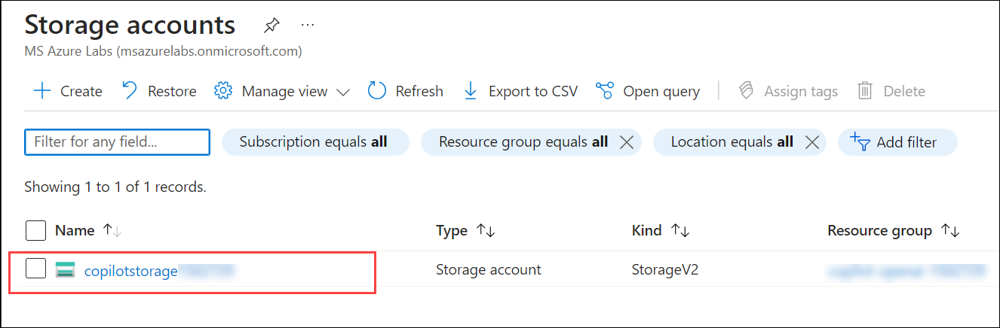
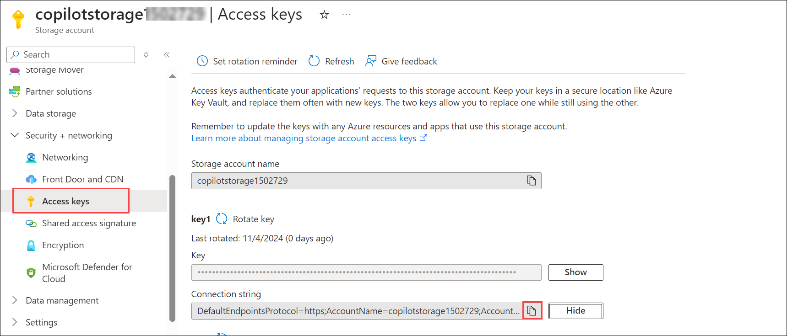
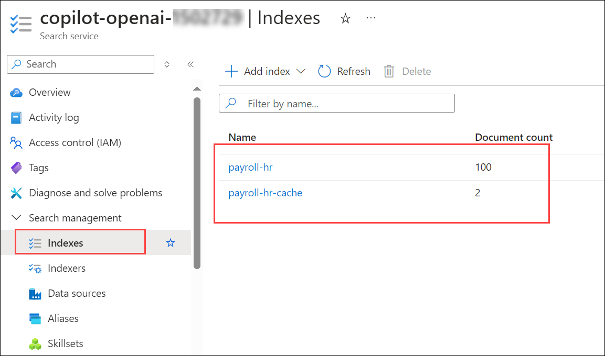
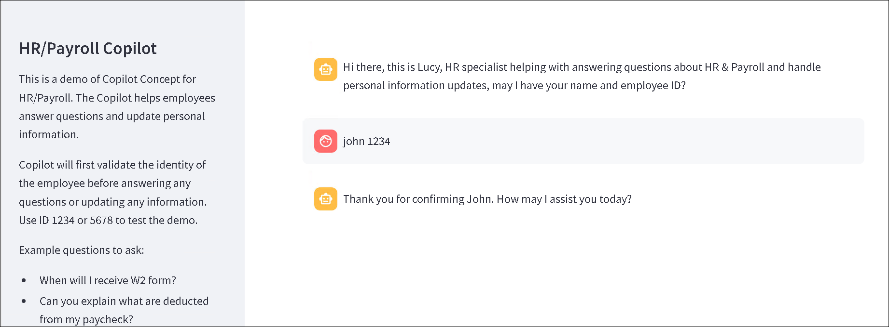
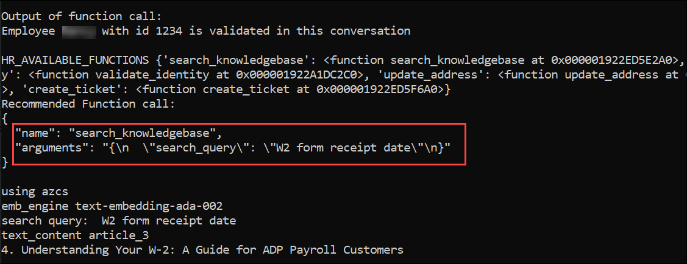

# Lab 3: Deploy and Run the HR/Payroll Copilot Application

   

**Smart Agent: At the heart of the solution is the Python object Smart_Agent. The agent has the following components:**

  - **Goals/Tasks:** Smart_Agent is given a persona and instructions to follow to achieve certain goals; for example, HR Copilot is about helping answer HR/Payroll questions and update employees' personal information. This is done using instructions specified in the system message.

  - **NLP interaction and tool execution:** For the ability to use multiple tools and functions to accomplish business tasks, the function calling capability of the 0613 version is utilized to intelligently select the right function (validate identity, search the knowledge base, update address, create ticket) based on the agent's judgment of what needs to be done. The agent is also able to engage with users by following the instructions and goals defined in the system message.

  - **Memory:** The agent maintains a memory of the conversation history. The memory is backed by Streamlit's session state.
  - **LLM:** The agent is linked to a 0613 GPT-4 model to power its intelligence.

    
### Task 1: Build your own HR/Payroll copilot locally

1. In the LabVM, open File Explorer, navigate to the below-mentioned path, right-click on the `secrets.env` file, and select open with  **Visual Studio Code**.

   ```
   C:\Labfiles\OpenAIWorkshop\scenarios\incubations\copilot
   ```

    

2. The Visual Studio code is opened on the desktop. Edit the below code and update the **Azure OpenAI Key**, **Embedding Model name and GPT Deployment name**, **Azure OpenAI Endpoint**, **Cognitive Search Endpoint**,and **AZURE_SEARCH_ADMIN_KEY** values that you have copied and stored in the text file earlier.


      | **Variables**                | **Values**                                                    |
   | ---------------------------- |---------------------------------------------------------------|
   | **DEPLOYMENT_NAME**          |  Replace the value with your **YOUR_GPT_MODEL** name               |
   | **DEPLOYMENT_NAME**          |  Replace the value with your **YOUR_EMBEDDING_MODEL** name               |
   | **OPENAI_API_BASE**          | **<inject key="OpenAIEndpoint" enableCopy="true"/>**          |
   | **OPENAI_API_KEY**           | **<inject key="OpenAIKey" enableCopy="true"/>**               |
   | **SEARCH_SERVICE_ENDPOINT**  | **<inject key="SearchServiceuri" enableCopy="true"/>**        |
   | **SEARCH_ADMIN_KEY**         | **<inject key="SearchAPIkey" enableCopy="true"/>**            |

4. After updating values, the `secrets.env` file should be as shown in the below screenshot. Press **CTRL + S** to save the file.

    

5. To run the application from the command line, navigate to Command Prompt and run the below command:

   > **Note**: Here, you can enter your email address below to get notifications. Otherwise, leave this field blank and click on **Enter**.

   ```
   cd C:\Labfiles\OpenAIWorkshop\scenarios\incubations\copilot\employee_support
   streamlit run hr_copilot.py
   ```

6. Once the execution of `streamlit run hr_copilot.py` is completed, a locally hosted HR Copliot application will be opened in the web browser. 

   

   

7. Run the following query to validate the identity of the employee:

   ```
   John 1234
   ```

   

8. Enter an example question such as `When will I receive the W2 form?`. The questions are answered by the Copilot by searching a knowledge base.

   

9. Copilot can help update employee information, like address updates. For other information update requests, Copilot will log a ticket to the HR team to update the information. Enter `I moved to 123 Main St., San Jose, CA 95112, please update my address` in the HR Copilot app.

    

10. Navigate back to **CMD** and stop the terminal by typing **ctrl + C**.

### Task 2: Integrate Azure Cognitive Search with your Application

1. In the **Azure Portal**, search and select **Storage accounts**. 

    

2. From the **Storage account** page, select **copilotstorage<inject key="Deployment ID" enableCopy="false"/>**.

    

3. From the left menu, select **Access keys** under **Security + networking** section. Copy the **Connection string** and store it in a text file for later use.

    

4. Next, navigate to **Azure AI services**, select **AI search (1)** from the left menu, and click on **copilot-openai-<inject key="Deployment ID" enableCopy="false"/> (2)**.

   

5. On the **Overview (1)** page, click on **Import data (2)**.

    

6.  Select **Azure Blob storage** as the **Data source**.

    

7. On the **Connect to your data** tab, provide the following details and click on **Next: Add cognitive skills (Optional) (7)**.

   | Settings| value|
   |---|---|
   |Data source name| **copilotstorage<inject key="Deployment ID" enableCopy="false"/>** **(1)**|
   |Data to extract| **Content and metadata** **(2)**|
   |Parsing mode| **JSON array** **(3)**|
   |Connection string | **YOUR_STORAGE_ACCOUNT_CONNECTIONSTRING (4)**|
   |Container name| **data (5)**|
   |Blob folder| **data (6)**|

   

8. On the **Add cognitive skills (optional)** tab, leave the default and click on **Skip to: Customize target index**.

9. Next, on the **Customize target index**  tab, enter the **Index name** as **payroll-hr (1)**. Set the values as provided in the below image (make sure you select `Collection(Edm.Single)` as the type for the content vector field).

   

10. Next, on the **contentVector** field, click on the **Eclipse** button in the right corner and select **Configure vector field**.

      

11. On the **Configure vector field** tab, set the **Dimensions** property to `1536` **(1)** and Click on **Create** **(2)** under No vector search profiles.

      

12. On the **Vector profile** tab, Click on **Create** under No algorithm configurations.

      

13. On the **Vector algorithm** tab, leave the default and click on **Save**.

      

14. On the **Vector profile** tab, select the algorithm created in the previous step and Click on **Create** under No vectorizers.

      

15. On the **Vector algorithm** tab, leave the default and select the Azure OpenAI service as **Copilot-OpenAI-<inject key="Deployment ID" enableCopy="false"/>** and model deployment as **text-embedding-ada-002** . Click on **Save**.

      

16. On the **Vector profile** tab, select the Vectorizers created in the previous step and Click on **Save**.

      

17. On the **Configure vector field** tab, keep the **Dimensions** property to `1536` and **Vector profile** created in previous step and Click on **Save**. Click on **Next: Create an indexer**.

      
    
18. Enter the **Indexer name** as **payroll-hr**, and click on **Submit**.

      

19. From the **Overview (1)** page, click on **Import data (2)** again.

       

20. On the **Connect to your data** tab, select the existing data source and select the storage account then, click **Next: Add cognitive skills (optional)**.

      

21. On the **Add cognitive skills (optional)** tab leave the default and click on **Skip to: Customize target index**.

22. Next, on the **Customize target index**  tab, enter the **Index name** as **payroll-hr-cache (1)**. Click on **+ Add field**, and create **id, search_query, search_query_vector, gpt_response** fields with the configurations as provided in the below image (make sure you select `Collection(Edm.Single)` as the type for the search_query_vector field).

      

23. In the **search_query_vector** field, click on the **Eclipse** button in the right corner and select **Configure vector field**.

      

24. On the **Configure vector field** tab, set the **Dimensions** property to `1536` **(1)** and Click on **Create** **(2)** under No vector search profiles.

      

25. On the **Vector profile** tab, Click on **Create** under No algorithm configurations.

      

26. On the **Vector algorithm** tab, leave the default and click on **Save**.

      

27. On the **Vector profile** tab, select the algorithm created in the previous step and Click on **Create** under No vectorizers.

      

28. On the **Vector algorithm** tab, leave the default and select the Azure OpenAI service as **Copilot-OpenAI-<inject key="Deployment ID" enableCopy="false"/>** and model deployment as **text-embedding-ada-002** . Click on **Save**.

      

29. On the **Vector profile** tab, select the Vectorizers created in the previous step and Click on **Save**.

      

30. On the **Configure vector field** tab, keep the **Dimensions** property to `1536` and **Vector profile** created in previous step and Click on **Save**. Click on **Next: Create an indexer**.

      

31. Enter the **Indexer name** as **payroll-hr-cache**, and click on **Submit**.

      

32. Navigate to the **Indexes** tab under the **Search management** section to view the newly created indexes, copy the index names, and save them in a text editor for later use.

      

33. Click on **Keys** from the left menu, copy the **Primary admin keys**, and store them in a text file for later use.

    

34. In the LabVM, open File Explorer, navigate to the below-mentioned path, right-click on the `secrets.env` file, and select open with  **Visual Studio Code**.

    ```
    C:\Labfiles\OpenAIWorkshop\scenarios\incubations\copilot
    ```
   
    

35. The Visual Studio code is opened on the desktop. Replace the following values and press **CTRL + S** to save the file.

     - **USE_AZCS**="**True**" #Set the value to true
     - **AZURE_SEARCH_INDEX_NAME**="YOUR_SEARCH_INDEX_NAME #Replace the value with the index name
     - **CACHE_INDEX_NAME**="YOUR_SEARCH_INDEX_NAME" #Replace the value with the cache index name
     - **AZURE_SEARCH_ADMIN_KEY**="YOUR_SEARCH_INDEX_NAME_KEY" #Replace the value with the primary admin key
 
36. In the LabVM, navigate to Desktop and search for `cmd` in the search box, then click on **Command Prompt**.

37. Run the below command to change the directory and run the HR Copilot application using the search service.

      > **Note**: Here, you can enter your email address below to get notifications. Otherwise, leave this field blank and click on **Enter**.

    ```bash
    cd C:\Labfiles\OpenAIWorkshop\scenarios\incubations\copilot\employee_support
    streamlit run hr_copilot.py
    ```

38. Run the following query to validate the identity of the employee:
   
      ```
      Nancy 1234
      ```

    


39. Enter an example question such as `When will I receive the W2 form?`. The questions are now answered by the Copilot by searching a knowledge base. You can review this by navigating back to the command prompt and viewing the output.

      

      

40. Navigate back to **CMD** and stop the terminal by typing **ctrl + C**.

### Task 3: Deploy the HR/Payroll Copilot application to Azure

1. In the LabVM, open File Explorer, navigate to the below-mentioned path, right-click on the `main.bicep` file, and select open with  **Visual Studio Code**.

      ```
      C:\LabFiles\OpenAIWorkshop\infra
      ```

    

2. In the **appsettings** section of the `main.bicep` file, replace the values below with the ones you copied previously in the text editor. Next, press **CTRL + S** to save the file.

      ```
      AZURE_OPENAI_API_KEY:'YOUR_OPENAI_KEY' //#Replace it with the OpenAI key.
      AZURE_OPENAI_ENDPOINT:'YOUR_OPENAI_ENDPOINT' //#Replace it with the OpenAI Endpoint.
      AZURE_OPENAI_EMB_DEPLOYMENT:'YOUR_EMBEDDING_MODEL' //#Replace with your embedding model name.
      AZURE_OPENAI_CHAT_DEPLOYMENT:'YOUR_GPT_MODEL' //#Replace with your Open AI Chat Deployment name.
      AZURE_SEARCH_SERVICE_ENDPOINT:'YOUR_SEARCH_SERVICE_ENDPOINT' //#Replace with Search Service Endpoint.
      AZURE_SEARCH_ADMIN_KEY:'YOUR_SEARCH_SERVICE_KEY' //#Replace with your Search Service Admin Key.
      ```

     


3. In the LabVM, navigate to Desktop and search for `cmd` in the search box, then click on **Command Prompt**.

4. Run the below command to change the directory.

   ```bash
   cd C:\LabFiles\OpenAIWorkshop
   ```

5. Run the below command to **Authenticate with Azure**. It will redirect you to the Azure-authorized website. Next, select your account.

   ```bash
   azd auth login
   ```

6. Run the below command to set up the resource group deployment and **Create a new environment**. Make sure to replace `{DeploymentId}` with **<inject key="Deployment ID" enableCopy="true"/>** in the below command.

   ```bash
   azd config set alpha.resourceGroupDeployments on
   ```
   
   ```bash
   azd env new copilot-{DeploymentId}
   ```

7. Run the below command to provision Azure resources and deploy your project with a single command.

   ```bash
   azd up
   ```
   
8. Please select your Azure subscription to use, enter `1`, and click on the **Enter** button.

   

9. Please select an Azure location to use, select the location as **<inject key="Region" enableCopy="false"/>** location, and click on the **Enter** button. You can change the location using the up and down arrows.

    

10. Next, select **copilot-openai-<inject key="Deployment ID" enableCopy="False"/>** resource group and hit **ENTER**.

    

11. Once the deployment succeeds, you will see the following message **SUCCESS: Your application was provisioned and deployed to Azure**. The deployment might take 5-10 minutes. It is producing a web package file, then creating the resource and publishing the package to the app service.


12. Navigate back to the Azure portal, search, and select **App service**. Select the available web app that you have deployed in the previous step.

    

13. Next, click on **Browse** to open your Web application.

    

    

    > **Note**: If an issue occurs when you try to launch the app service, please restart the app service and wait five minutes before trying to launch the app again.

   <validation step="e563f609-c163-48c7-816f-e11985cba271" />
 
   > **Congratulations** on completing the lab! Now, it's time to validate it. Here are the steps:
   > - Navigate to the Lab Validation Page, from the upper right corner in the lab guide section.
   > - Hit the Validate button for the corresponding task. If you receive a success message, you can proceed to the next task. 
   > - If not, carefully read the error message and retry the step, following the instructions in the lab guide.
   > - If you need any assistance, please contact us at labs-support@spektrasystems.com. We are available 24/7 to help you out.
