# Lab 4: Understand HR Copilot Demo Application 

When the scope of automation spans across multiple functional domains, similar to how human teams operate, an AI system often performs better when each agent specializes in a specific area. Instead of overloading a single agent with multiple capabilities, a **multi-agent copilot model** can be implemented, where each agent is responsible for a distinct domain such as HR, Payroll, or IT support.

These specialist agents are managed and coordinated by a manager agent, commonly referred to as the **agent runner**. The agent runner is responsible for promoting the appropriate agent from the agent pool to become the active agent that interacts with the user. It also ensures that relevant context is transferred between agents to maintain conversational continuity.

In this model, the agent runner relies on cues from specialist agents to determine when a handoff is required. Each specialist agent must implement a back-off mechanism that sends a notification when it determines that the user’s request falls outside its expertise. While the specialist agent can signal the need for transfer, the final decision on which agent should take over remains with the agent runner.

When such a transfer request is received, the agent runner evaluates the context and selects the most appropriate agent for the task. This decision-making process can itself be powered by a lifecycle-supported Azure OpenAI model such as **GPT-4.1**, **GPT-4.1-mini**, or a **GPT-5 family model**, replacing legacy models like `gpt-35-turbo`, which have been retired as per Microsoft’s model lifecycle guidance.

The agent runner invokes each specialist agent’s `run` method and maintains persistent memory that is accessible across agent sessions. This shared memory ensures that important contextual information is preserved even when control shifts between agents.

The multi-agent solution operates on the same application platform (Streamlit) as the single HR Copilot implementation, but enhances scalability, domain specialization, orchestration efficiency, and alignment with Azure’s modern GPT model ecosystem.

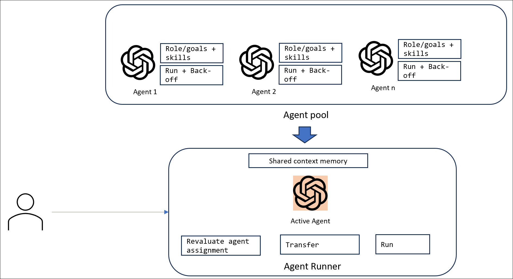


## Exercise 1: Deploy and run the multi-agent Copilot application

### Task 1: Build your own multi-agent Copilot application locally

Before we proceed further, In the LabVM, open File Explorer, navigate to the below-mentioned path, right-click on the `secrets.env` file, and select open with **Visual Studio Code**.

```
C:\Labfiles\OpenAIWorkshop\scenarios\incubations\copilot
```

 

- Replace **USE_AZCS**="**False**" in the Visual Studio code, then press **CTRL + S** to save the file.

   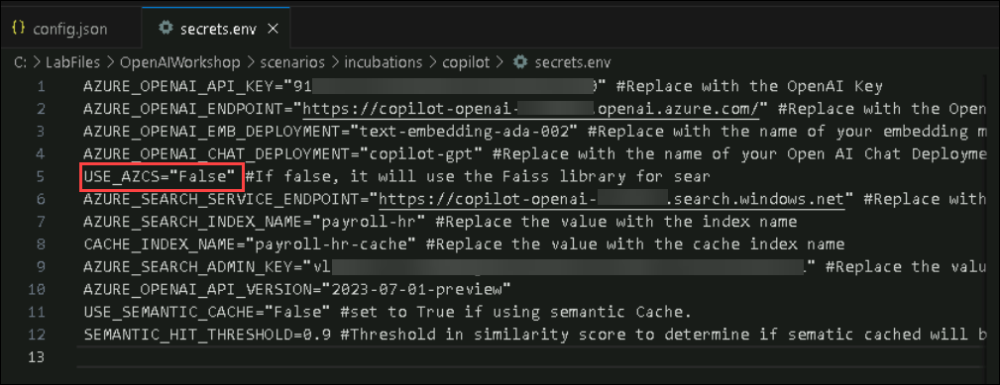

1. In the LabVM, navigate to Desktop and search for `cmd` in the search box, then click on **Command Prompt**.

2. Run the below command to change the directory.

   ```
   cd C:\LabFiles\OpenAIWorkshop\scenarios\incubations\copilot\employee_support
   ```

3. To run the application from the command line, navigate back to Command Prompt and run the below command:

   >**Note**: Here, you can enter your email address below to get notifications. Otherwise, leave this field blank and then click on **Enter**.

   ```
   streamlit run multi_agent_copilot.py
   ```

4. Once the execution of `streamlit run multi_agent_copilot.py` is completed, a locally hosted HR Copliot application will be opened in the web browser. 

   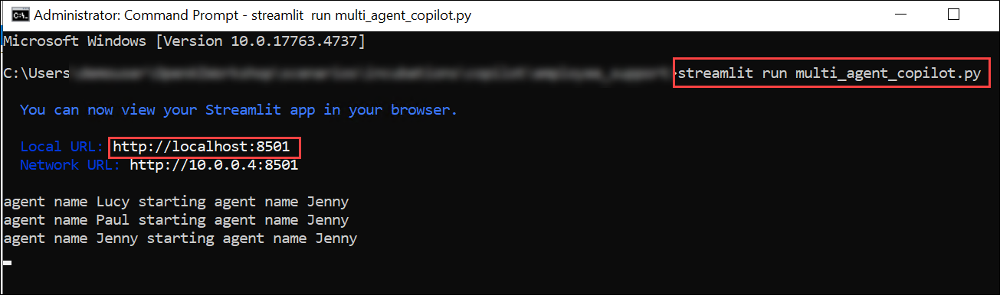

   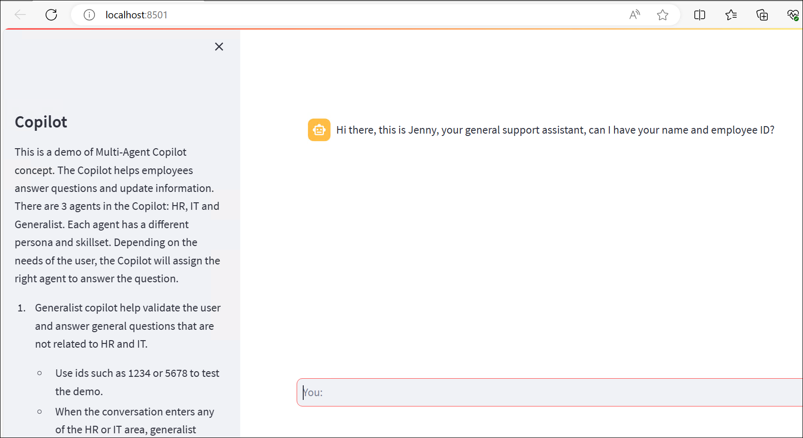

5. Run the following query to validate the identity of the employee:

   ```
   Sharon 1234
   ```

   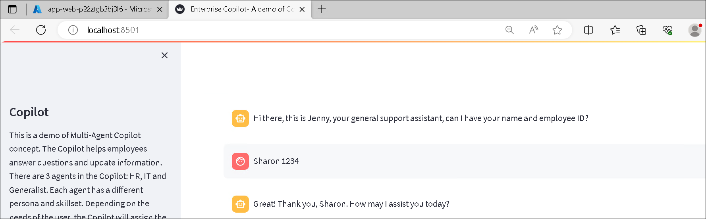

6. Enter an example question such as `How do I reset my password?`. The questions are answered by the Copilot by searching a knowledge base.

   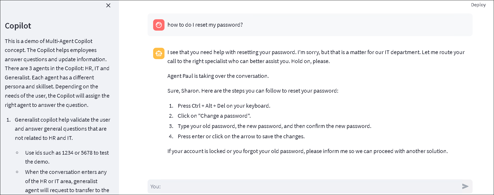

7. Navigate back to **CMD** and stop the terminal by typing **ctrl + C**.
   
### Task 2: Deploy a multi-agent Copilot application to Azure

1. In the LabVM, open File Explorer, navigate to the below-mentioned  path, right-click on the `main.bicep` file, and select open with  **Visual Studio Code**.

   ```
   C:\LabFiles\OpenAIWorkshop\infra
   ```

    

2. In the `main.bicep` file, replace the file name in **Line 49** with `multi_agent_copilot.py` and press **CTRL + S** to save the file.

    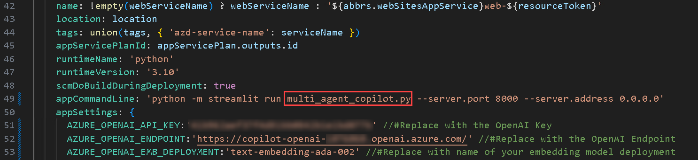

3. In the LabVM, navigate to Desktop and search for `cmd` in the search box, then click on **Command Prompt**.

4. Run the below command to change the directory.

   ```bash
   cd C:\LabFiles\OpenAIWorkshop
   ```

5. Run the below command to **Authenticate with Azure**. It will redirect you to the Azure Authorize website, where you can select your account.

   ```bash
   azd auth login
   ```

6. Run the below command to set up the resource group deployment and **Create a new environment**. Make sure to replace `{DeploymentId}` with **<inject key="Deployment ID" enableCopy="true"/>** in the below command.

   ```bash
   azd config set alpha.resourceGroupDeployments on
   ```
   
   ```bash
   azd env new azure-copilot-{DeploymentId}
   ```

7. Run the below command to provision Azure resources and deploy your project with a single command.

   ```bash
   azd up
   ```
   
8. Please select your Azure subscription to use, enter `1`, and click on the **Enter** button.

   

9. Please select an Azure location to use, select the location as **<inject key="Region" enableCopy="false"/>** location, and click on the **Enter** button. You can change the location using the up and down arrows.

   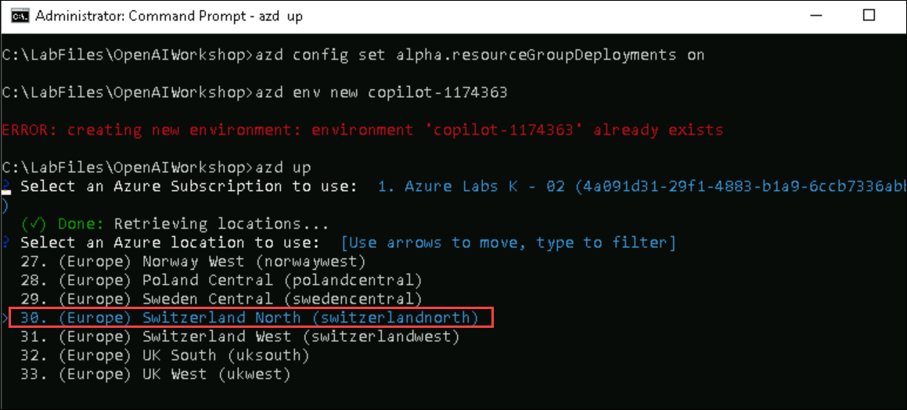

10. Next, select the **multiagent-<inject key="Deployment ID" enableCopy="False"/>** resource group and hit **ENTER**.

    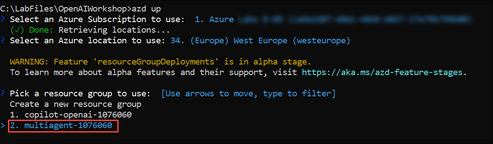

11. Once the deployment succeeds, you will see the following message **SUCCESS: Your application was provisioned and deployed to Azure**. The deployment might take 5-10 minutes. It is producing a web package file, then creating the resource and publishing the package to the app service.


12. Navigate back to the Azure portal and select **App service** from the **multiagent-<inject key="Deployment ID" enableCopy="False"/>** resource group.

    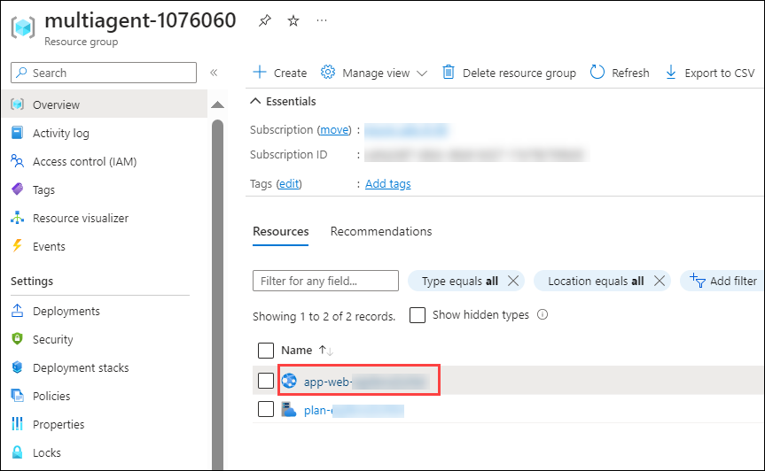

13. Next, click on **Browse** to open your Web application.

    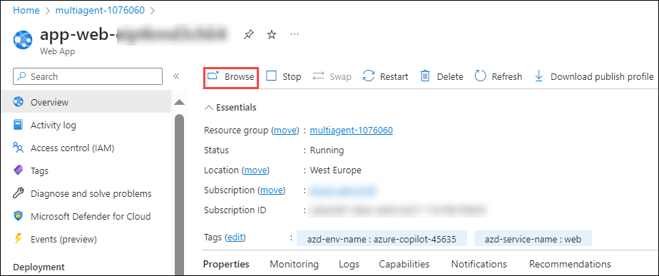

    

    > **Note**: If an issue occurs when you try to launch the app service, please restart the app service and wait five minutes before trying to launch the app again.
