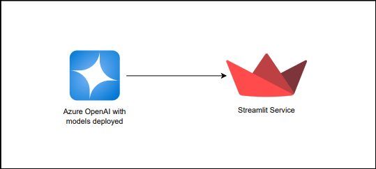
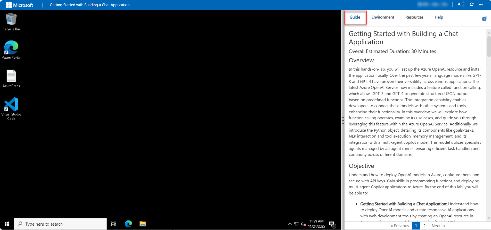
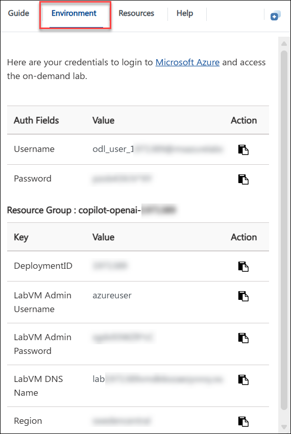

# Getting Started with Building a Chat Application

### Overall Estimated Duration: 30 Minutes

## Overview

In this hands-on lab, you will provision an Azure OpenAI resource in Azure AI Foundry and install the application locally. Modern Azure OpenAI deployments now focus on lifecycle-supported models such as GPT-4.1, GPT-4.1-mini, and the GPT-5 family, replacing legacy GPT-3 and earlier GPT-4 variants. This ensures your solution is aligned with Microsoft’s current model roadmap and long-term upgrade strategy.

A key capability you will explore is **Function Calling**, which enables GPT-4.1 and GPT-5 class models to return structured JSON outputs mapped to predefined functions. Instead of generating only natural language responses, the model can determine when to invoke external tools and provide validated arguments for execution. This structured interaction allows developers to integrate AI models with APIs, databases, and backend services to build intelligent, production-ready applications.

Additionally, this lab introduces an agent-based architecture using Python. You will examine how an AI agent is structured around defined goals and tasks, natural language interaction, tool execution, and memory management. You will also explore how a multi-agent copilot model uses specialist agents coordinated by an agent runner to efficiently manage tasks and maintain continuity across domains.

## Objective

Understand how to deploy supported Azure OpenAI models (such as GPT-4.1 or GPT-5 family models), configure them securely, and integrate them into intelligent applications using function calling and agent-based design.

By the end of this lab, you will be able to:

- **Getting Started with Building a Chat Application:** Deploy a lifecycle-supported Azure OpenAI model, configure secure access using API keys or Microsoft Entra ID, and build a responsive AI-powered chat application integrated with function calling capabilities.
- Implement structured function calling to connect the model with external services or APIs.
- Design and deploy a multi-agent copilot application using Python.

## Pre-requisites

Participants should have:

- **Familiarity with Modern GPT Models:** Understanding of GPT-4.1 class or GPT-5 class models and their enterprise use cases within Azure OpenAI.
- **Experience with REST APIs:** Familiarity with REST APIs, as function calling involves interacting with external services.
- **Basic Programming Skills:** Proficiency in Python to follow along with the Smart_Agent object setup and multi-agent copilot implementation.
- **Basic Azure Knowledge:** Familiarity with Azure Portal and resource deployment concepts.

## Architecture

In this hands-on lab, the architecture flow includes several essential components. You’ll begin by setting up the Azure OpenAI resource in Azure AI Foundry and installing the required application locally. At the heart of the architecture is the Azure OpenAI Service, utilizing lifecycle-supported models such as GPT-4.1, GPT-4.1-mini, or GPT-5 family models with function calling capabilities to generate structured JSON outputs from predefined functions. These structured outputs enable seamless integration with various systems, APIs, and backend tools.

The Smart_Agent Python object plays a crucial role, handling tasks such as goal definition, natural language processing (NLP) interactions, tool execution, and conversation memory management, while securely connecting to the deployed Azure OpenAI model. Additionally, the system leverages a multi-agent copilot model, where a specialized agent runner manages and coordinates tasks among multiple domain-specific agents, ensuring efficient task handling, contextual continuity, and scalable orchestration across different domains.

## Architecture Diagram

## Explanation of Components

The architecture for this lab involves the following key components:

- **Azure OpenAI:** Azure OpenAI Service provides REST API access to OpenAI's powerful language models and these models integrates with your data, enabling customized and secure interactions.

- **Azure OpenAI Models:** Offers pre-trained and customizable large language models for various AI applications. These models allow for powerful AI-driven solutions by generating tailored and contextually relevant content based on well-crafted prompts.

## Getting Started with the Lab

1. After the environment has been set up, your browser will load a virtual machine (JumpVM) and the lab manual. Use this virtual machine throughout the workshop to perform the lab. You can see the number on the bottom of the lab guide to switch to different exercises in the lab guide.

   
 
1. To get the lab environment details, you can select the **Environment** details tab. Additionally, the credentials will also be emailed to your registered email address. Additionally, under the **Resources** tab, you may start, stop, and restart virtual machines.

   
 
   > You will see the SUFFIX value on the **Environment Details** tab; use it wherever you see SUFFIX or DeploymentID in lab steps.
 
## Login to the Azure Portal

1. In the JumpVM, click on the Azure portal shortcut of the Microsoft Edge browser, which is created on the desktop.

   
   
2. On the **Sign in to Microsoft Azure** tab, you will see the login screen. Enter the following email or username, and click on **Next**. 

   * **Email/Username**: <inject key="AzureAdUserEmail"></inject>
   
      
     
3. Now enter the following password and click on **Sign in**.
   
   * **Password**: <inject key="AzureAdUserPassword"></inject>
   
      
     
4. If you see the pop-up **Stay Signed in?**, select **No**.

   

5. If a **Welcome to Microsoft Azure** popup window appears, select **Maybe Later** to skip the tour.
   
6. Now that you will see the Azure Portal Dashboard, click on **Resource groups** from the Navigate panel to see the resource groups.

   

7. Click "Next" from the bottom right corner to embark on your Lab journey!

     

### Support Contact
The CloudLabs support team is available 24/7, 365 days a year, via email and live chat to ensure seamless assistance at any time. We offer dedicated support channels tailored specifically for both learners and instructors, ensuring that all your needs are promptly and efficiently addressed.
 
Learner Support Contacts:
 
- Email Support: cloudlabs-support@spektrasystems.com
- Live Chat Support: https://cloudlabs.ai/labs-support
 
### Happy learning !
