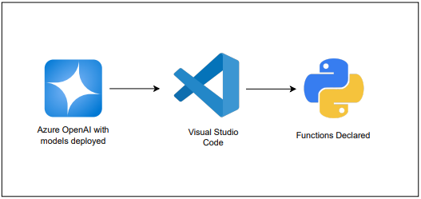
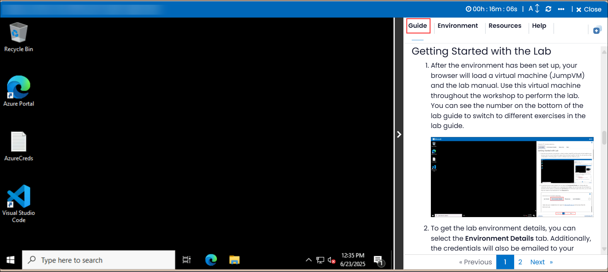
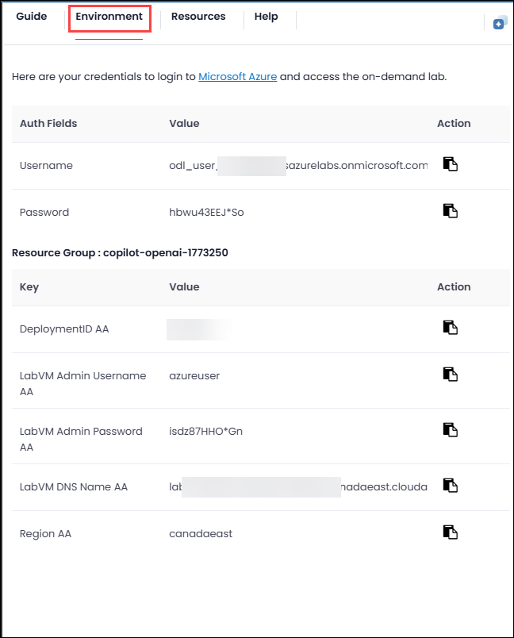

# Understand function calling in Open AI GPT

### Overall Estimated Duration: 30 Minutes

## Overview

In this hands-on-lab, you will set up the Azure OpenAI resource and install the application locally. Over the past few years, language models like GPT-3 and GPT-4 have proven their versatility across various applications. The latest Azure OpenAI Service now includes a feature called function calling, which allows GPT-3 and GPT-4 to generate structured JSON outputs based on predefined functions. This integration capability enables developers to connect these models with other systems and tools, enhancing their functionality. In this overview, we will explore how function calling operates, examine its use cases, and guide you through leveraging this feature within the Azure OpenAI Service. Additionally, we'll introduce the Python object, detailing its components like goals/tasks, NLP interaction and tool execution, memory management, and its integration with a multi-agent copilot model. This model utilizes specialist agents managed by an agent runner, ensuring efficient task handling and continuity across different domains.

## Objective

Understand how to deploy OpenAI models in Azure, configure them, and secure with API keys. Gain skills in programming functions and deploying multi-agent Copilot applications to Azure. By the end of this lab, you will be able to:

- **Understand function calling in Open AI GPT:** You will have gained a thorough understanding of function calling within the context of programming. You will be able to define functions, understand their syntax, and recognize the importance of parameters and return values.

## Pre-requisites

Participants should have:

- **Familiarity with GPT Models:** Familiarity with GPT-3 and GPT-4, including their capabilities and use cases.

- **Experience with REST APIs:** Familiarity with REST APIs, as function calling involves interacting with APIs.

- **Basic Programming Skills:** Proficiency in Python programming to follow along with the Smart_Agent Python object setup and multi-agent copilot model implementation.

## Architecture

In this hands-on lab, the architecture flow includes several essential components. You’ll begin by setting up the Azure OpenAI resource and installing the required application locally. At the heart of the architecture is the Azure OpenAI Service, utilizing GPT-3 and GPT-4’s function calling features to generate structured JSON outputs from predefined functions. These outputs enable smooth integration with various systems and tools. The Smart_Agent Python object plays a crucial role, handling tasks such as goal setting, NLP interactions, and tool execution, while maintaining conversation memory and connecting to a GPT-4 model. Additionally, the system uses a multi-agent copilot model, where a specialized agent runner manages and coordinates tasks among different specialist agents, ensuring efficient task management and continuity across diverse domains.

## Architecture Diagram

## Explanation of Components

The architecture for this lab involves the following key components:

- **Azure OpenAI:** Azure OpenAI Service provides REST API access to OpenAI's powerful language models and these models integrates with your data, enabling customized and secure interactions.

- **Azure OpenAI Models:** Offers pre-trained and customizable large language models for various AI applications. These models allow for powerful AI-driven solutions by generating tailored and contextually relevant content based on well-crafted prompts.

## Getting Started with the Lab

1. After the environment has been set up, your browser will load a virtual machine (JumpVM) and the lab manual. Use this virtual machine throughout the workshop to perform the lab. You can see the number on the bottom of the lab guide to switch to different exercises in the lab guide.

   
 
1. To get the lab environment details, you can select the **Environment Details** tab. Additionally, the credentials will also be emailed to your registered email address. Additionally, under the **Resources** tab, you may start, stop, and restart virtual machines.

   
 
   > You will see the SUFFIX value on the **Environment Details** tab; use it wherever you see SUFFIX or DeploymentID in lab steps.
 
## Login to the Azure Portal

1. In the JumpVM, click on the Azure portal shortcut of the Microsoft Edge browser, which is created on the desktop.

   
   
2. On the **Sign in to Microsoft Azure** tab, you will see the login screen. Enter the following email or username, and click on **Next**. 

   * **Email/Username**: <inject key="AzureAdUserEmail"></inject>
   
      
     
3. Now enter the following password and click on **Sign in**.
   
   * **Password**: <inject key="AzureAdUserPassword"></inject>
   
      
     
4. If you see the pop-up **Stay Signed in?**, select **No**.

5. If **Action Required** pop-up window appears, click on **Ask later**.

      

6. If you see the pop-up **You have free Azure Advisor recommendations!**, close the window to continue the lab.

7. If a **Welcome to Microsoft Azure** popup window appears, select **Maybe Later** to skip the tour.
   
8. Now that you will see the Azure Portal Dashboard, click on **Resource groups** from the Navigate panel to see the resource groups.

   

9. Click "Next" from the bottom right corner to embark on your Lab journey!

     

### Support Contact
The CloudLabs support team is available 24/7, 365 days a year, via email and live chat to ensure seamless assistance at any time. We offer dedicated support channels tailored specifically for both learners and instructors, ensuring that all your needs are promptly and efficiently addressed.
 
Learner Support Contacts:
 
- Email Support: cloudlabs-support@spektrasystems.com
- Live Chat Support: https://cloudlabs.ai/labs-support
 
### Happy learning !
