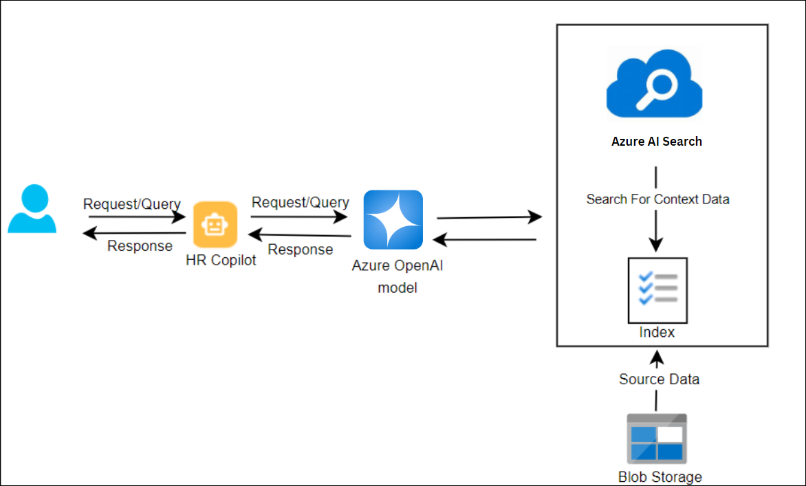
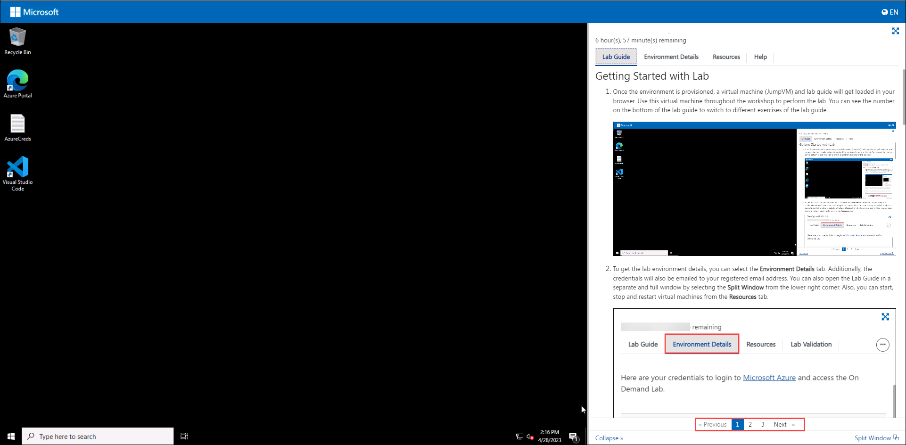
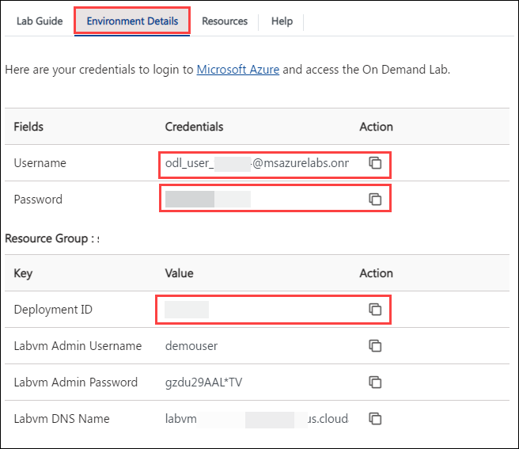
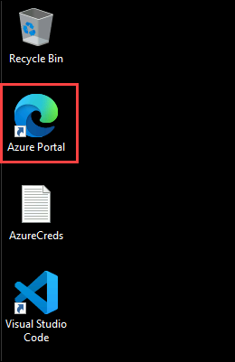
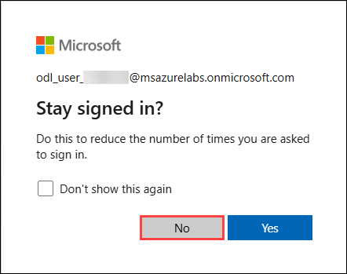

# Deploy and Run the HR/Payroll Copilot Application

### Overall Estimated Duration: 120 Minutes

## Overview

In this hands-on lab, you will provision an Azure OpenAI resource in Azure AI Foundry and install the HR/Payroll Copilot application locally. Modern Azure OpenAI deployments focus on lifecycle-supported models such as GPT-4.1, GPT-4.1-mini, and the GPT-5 family, replacing legacy GPT-3 and earlier GPT-4 variants. This ensures your implementation aligns with Microsoft’s current model roadmap and long-term upgrade strategy.

A key capability explored in this lab is **Function Calling**, which enables GPT-4.1 and GPT-5 class models to generate structured JSON outputs mapped to predefined functions. Instead of returning only conversational text, the model can intelligently determine when to invoke backend functions and provide validated arguments for execution. This structured integration enables seamless connectivity between the copilot application and HR/Payroll systems, APIs, and enterprise tools.

You will also work with a Python-based Smart_Agent object that manages goals and task execution, handles natural language interactions, executes tools, and maintains conversational memory. The solution is built using a multi-agent copilot architecture, where specialist agents are coordinated by an agent runner to efficiently manage HR and payroll-related workflows while maintaining context across interactions.

## Objective

Understand how to deploy lifecycle-supported Azure OpenAI models, configure secure access, and implement a multi-agent HR/Payroll Copilot application using function calling.

By the end of this lab, you will be able to:

- **Deploy and Run the HR/Payroll Copilot Application:** Gain practical skills in building AI-driven enterprise applications, integrating structured function calling for HR/Payroll workflows, enhancing search and automation capabilities, and deploying a scalable, production-ready solution in Azure.

## Pre-requisites

Participants should have:

- **Familiarity with Modern GPT Models:** Understanding of GPT-4.1 class or GPT-5 class models and their enterprise capabilities within Azure OpenAI.

- **Experience with REST APIs:** Familiarity with REST APIs, as function calling involves interacting with backend services.

- **Basic Programming Skills:** Proficiency in Python programming to follow along with the Smart_Agent object setup and multi-agent copilot model implementation.

- **Basic Azure Knowledge:** Familiarity with Azure Portal and resource deployment concepts.

## Architecture

In this hands-on lab, the architecture flow includes several essential components. You’ll begin by provisioning the Azure OpenAI resource in Azure AI Foundry and deploying a lifecycle-supported model such as GPT-4.1 or a GPT-5 family model. At the core of the architecture is the Azure OpenAI Service utilizing function calling capabilities to generate structured JSON outputs from predefined HR/Payroll functions. These structured outputs enable secure and reliable integration with enterprise systems and services.

The Smart_Agent Python object plays a crucial role, handling tasks such as goal definition, natural language processing (NLP) interactions, tool execution, and conversation memory management, while securely connecting to the deployed Azure OpenAI model. Additionally, the system uses a multi-agent copilot architecture, where a specialized agent runner coordinates multiple domain-specific agents (such as HR and Payroll agents), ensuring efficient workflow orchestration and contextual continuity across diverse operational scenarios.

## Architecture Diagram

## Explanation of Components

The architecture for this lab involves the following key components:

- **Azure OpenAI:** Azure OpenAI Service provides REST API access to OpenAI's powerful language models and these models integrates with your data, enabling customized and secure interactions.

- **Azure OpenAI Models:** Offers pre-trained and customizable large language models for various AI applications. These models allow for powerful AI-driven solutions by generating tailored and contextually relevant content based on well-crafted prompts.

- **Azure AI Search:** Azure AI Search is a cloud-based service that enhances search experiences with AI-powered capabilities like full-text and cognitive search. It integrates easily with various data sources for rich, insightful search results.

## Getting Started with the Lab

1. After the environment has been set up, your browser will load a virtual machine (JumpVM) and the lab manual. Use this virtual machine throughout the workshop to perform the lab. You can see the number on the bottom of the lab guide to switch to different exercises in the lab guide.

   
 
1. To get the lab environment details, you can select the **Environment Details** tab. Additionally, the credentials will also be emailed to your registered email address. Additionally, under the **Resources** tab, you may start, stop, and restart virtual machines.

   
 
   > You will see the SUFFIX value on the **Environment Details** tab; use it wherever you see SUFFIX or DeploymentID in lab steps.
 
## Login to the Azure Portal

1. In the JumpVM, click on the Azure portal shortcut of the Microsoft Edge browser, which is created on the desktop.

   
   
2. On the **Sign in to Microsoft Azure** tab, you will see the login screen. Enter the following email or username, and click on **Next**. 

   * **Email/Username**: <inject key="AzureAdUserEmail"></inject>
   
      
     
3. Now enter the following password and click on **Sign in**.
   
   * **Password**: <inject key="AzureAdUserPassword"></inject>
   
      
     
4. If you see the pop-up **Stay Signed in?**, select **No**.

      

7. If a **Welcome to Microsoft Azure** popup window appears, select **Maybe Later** to skip the tour.
   
8. Now that you will see the Azure Portal Dashboard, click on **Resource groups** from the Navigate panel to see the resource groups.

   

9. Click "Next" from the bottom right corner to embark on your Lab journey!

     

### Support Contact
The CloudLabs support team is available 24/7, 365 days a year, via email and live chat to ensure seamless assistance at any time. We offer dedicated support channels tailored specifically for both learners and instructors, ensuring that all your needs are promptly and efficiently addressed.
 
Learner Support Contacts:
 
- Email Support: cloudlabs-support@spektrasystems.com
- Live Chat Support: https://cloudlabs.ai/labs-support
 
### Happy learning !

