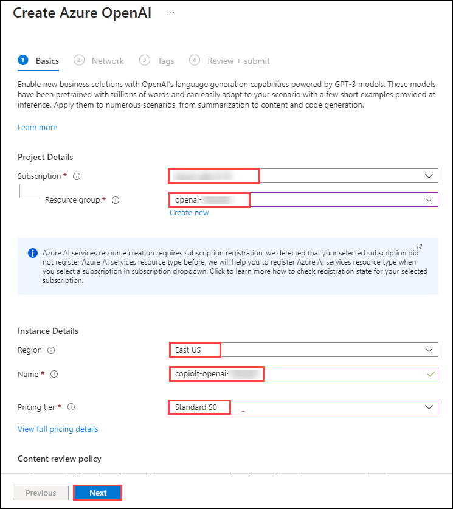
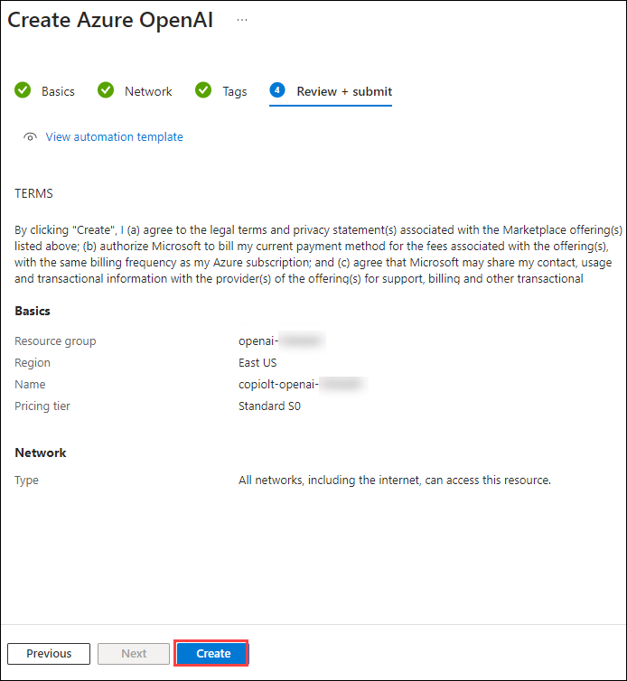
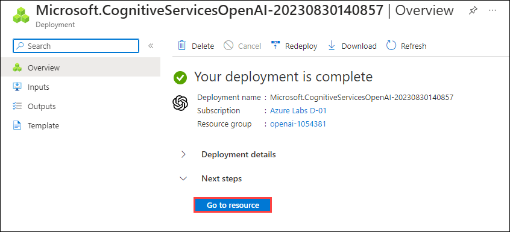
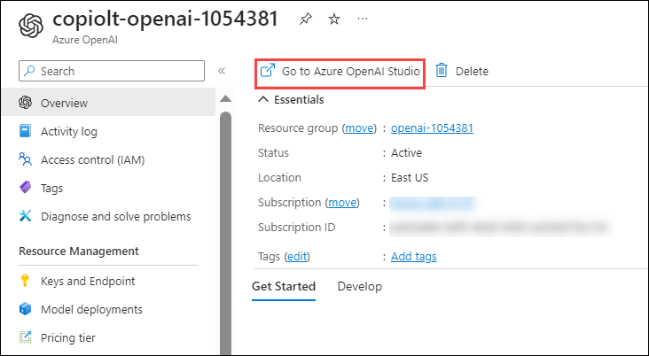
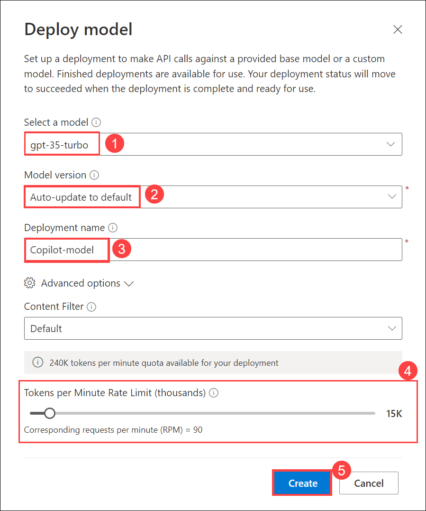

# Lab 1: Getting started with building Chat Application

## Exercise 1: Open AI setup and Installation of Application

In this exercise, you will be setting up the Open AI resource and installtion of application locally.

### Task 1: Create Open AI resource (Read-Only)

1. In the Azure portal, search for **Azure OpenAI** **(1)** in the top search box then select **Azure OpenAI** **(2)** under services.

   
   
1. From the **Cognitive Services | Azure OpenAI** pane, click on **Create**.

   
   
1. In the Create Azure OpenAI pane under Basics tab, select the default subscription and select the existing **sql-chat-gpt-<inject key="Deployment ID" enableCopy="false"/>** resource group. Select **East US** as Region, enter Name as **copiolt-openai-<inject key="Deployment ID" enableCopy="false"/>** and select **Standard S0** for Pricing tier. Click on **Next**

   
   
1. Leave default settings for Network and Tags tabs, click on **Next**.

1. In the Review + submit pane, verify that validation passed and then click on **Create**.

   
   
1. Deployment will take 5 minutes to complete. Once the deployments is succeeded, click on **Go to resource**.

   
   
1. In the Azure OpenAI resource pane, select **Go to Azure OpenAI Studio**.

   
   
1. In the Azure OpenAI Studio click **Deployment (1)** and click **+ Create new deployment (2)**.

   
   
1. On the **Deploy Model** tab enter the following details and click on **Create (5)**.

   - Select a model: **gpt-35-turbo (1)**
   - Model version: **Auto-update to default (2)**
   - Deployment name: **Copilot-model (3)**
   - Tokens per Minute Rate Limit (thousands): **15K (4)**

   
   
### Task 2: Install the application locally

1. In the LabVM, navigate to Desktop and search for `cmd` in the search box then click on **Command Prompt**.
   
1. Run the below command to change the directory.

   ```
   C:\LabFiles\OpenAIWorkshop-Automation\scenarios\incubations\automating_analytics
   ```
   
1. Provide settings for Open AI and Database by creating a ```secrets.env``` file in the root of this folder by running the below command.

   ```
   code secrets.env
   ```
   
1. You will see the Visual Studio code is opened in the desktop. Enter the below code and update the OpenAI Key, Model Name and Endpoint values which you have copied and stored in text file earlier.

   ```
   AZURE_OPENAI_API_KEY="********************************" #Replace with the OpenAI Key
   AZURE_OPENAI_GPT4_DEPLOYMENT="NAME_OF_GPT_4_DEPLOYMENT" #Replace with the OpenAI Model Name
   AZURE_OPENAI_CHATGPT_DEPLOYMENT="NAME_OF_CHATGPT_4_DEPLOYMENT" #Replace with the OpenAI Model
   AZURE_OPENAI_ENDPOINT=https://openairesourcename.openai.azure.com/ #Replace with the OpenAI Endpoint
   SQL_ENGINE = "sqlite"
   ```
   
1. After updating values the `secrets.env` file should be as shown in the below screenshot, press **CTRL + S** to save the file.

   
   
1. To run the application from the command line navigate back to Command Prompt and run the below command:

   >**Note**: Here, you can enter your email address below to get notifications. Otherwise, leave this field blank and click on **Enter**.

   ```
   streamlit run app.py
   ```
   
1. Once the execution of `streamlit run app.py` is completed. A locally hosted demo appliation will be opened in the web browser. 

   
   
   
