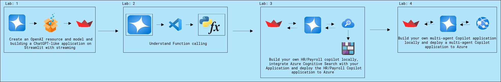
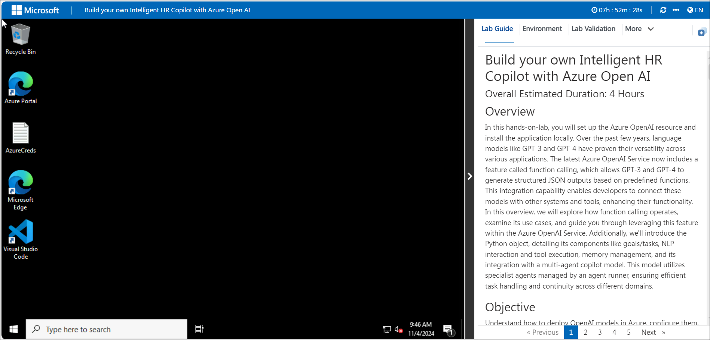
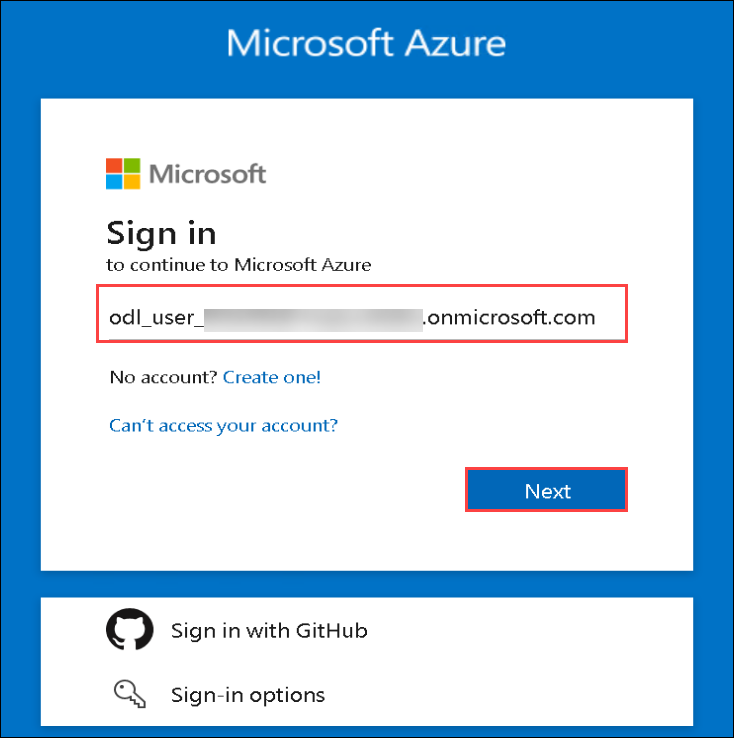
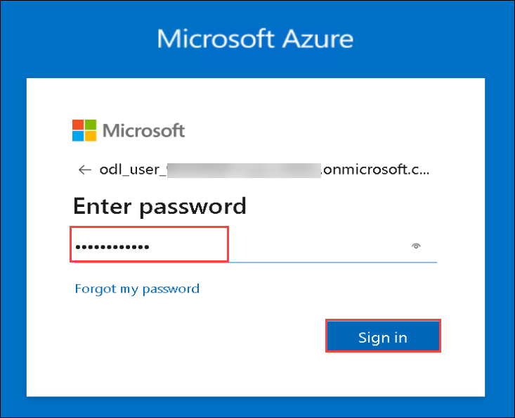

# Build your own Intelligent HR Copilot with Azure OpenAI

### Overall Estimated Duration: 4 Hours

## Overview

In this hands-on-lab, you will set up the Azure OpenAI resource and install the application locally. Over the past few years, language models like GPT-3 and GPT-4 have proven their versatility across various applications. The latest Azure OpenAI Service now includes a feature called function calling, which allows GPT-3 and GPT-4 to generate structured JSON outputs based on predefined functions. This integration capability enables developers to connect these models with other systems and tools, enhancing their functionality. In this overview, we will explore how function calling operates, examine its use cases, and guide you through leveraging this feature within the Azure OpenAI Service. Additionally, we'll introduce the Python object, detailing its components like goals/tasks, NLP interaction and tool execution, memory management, and its integration with a multi-agent copilot model. This model utilizes specialist agents managed by an agent runner, ensuring efficient task handling and continuity across different domains.

## Objective

Understand how to deploy OpenAI models in Azure, configure them, and secure with API keys. Gain skills in programming functions and deploying multi-agent Copilot applications to Azure. By the end of this lab, you will be able to:

- **Getting Started with Building a Chat Application**: Understand how to deploy OpenAI models and create responsive AI applications with web development tools by creating an OpenAI resource in Azure, configuring a model, and securing it with API keys.
- **Understand function calling in Open AI GPT**: You will have gained a thorough understanding of function calling within the context of programming. You will be able to define functions, understand their syntax, and recognize the importance of parameters and return values. 
- **Deploy and Run the HR/Payroll Copilot Application**: Gain practical skills in creating AI-driven applications, enhancing search capabilities, and managing cloud deployments, resulting in a scalable and efficient solution.
- **Understand HR Copilot Demo Application**: Learn how to build a multi-agent Copilot application locally and then deploy it to Azure, gaining hands-on experience in both development and cloud deployment.
  
## Pre-requisites

Participants should have:

- **Familiarity with GPT Models**: Familiarity with GPT-3 and GPT-4, including their capabilities and use cases.
- **Experience with REST APIs**: Familiarity with REST APIs, as function calling involves interacting with APIs.
- **Basic Programming Skills**: Proficiency in Python programming to follow along with the Smart_Agent Python object setup and multi-agent copilot model implementation.

## Architecture

In this hands-on lab, the architecture flow includes several essential components. You’ll begin by setting up the Azure OpenAI resource and installing the required application locally. At the heart of the architecture is the Azure OpenAI Service, utilizing GPT-3 and GPT-4’s function calling features to generate structured JSON outputs from predefined functions. These outputs enable smooth integration with various systems and tools. The Smart_Agent Python object plays a crucial role, handling tasks such as goal setting, NLP interactions, and tool execution, while maintaining conversation memory and connecting to a GPT-4 model. Additionally, the system uses a multi-agent copilot model, where a specialized agent runner manages and coordinates tasks among different specialist agents, ensuring efficient task management and continuity across diverse domains.

## Architecture Diagram

## Explanation of Components

The architecture for this lab involves the following key components:

- **Azure OpenAI**: Azure OpenAI Service provides REST API access to OpenAI's powerful language models and these models integrates with your data, enabling customized and secure interactions.
- **Azure OpenAI Models**: Offers pre-trained and customizable large language models for various AI applications. These models allow for powerful AI-driven solutions by generating tailored and contextually relevant content based on well-crafted prompts.
- **Azure App Services**: Azure App Services is a fully managed platform for building, deploying, and scaling web apps and APIs. It supports various programming languages and frameworks, offering built-in security, load balancing, and auto-scaling to simplify application management.
- **Azure AI Search**: Azure AI Search is a cloud-based service that enhances search experiences with AI-powered capabilities like full-text and cognitive search. It integrates easily with various data sources for rich, insightful search results.
- **Azure Blob Storage**: Azure Blob Storage is a scalable solution for storing unstructured data like text and multimedia files.

## Getting Started with the Lab
 
Welcome to your Build your own Intelligent HR Copilot with Azure OpenAI Workshop! We've prepared a seamless environment for you to explore and learn about Azure services. Let's begin by making the most of this experience:
 
## Accessing Your Lab Environment
 
Once you're ready to dive in, your virtual machine and lab guide will be right at your fingertips within your web browser.

### Virtual Machine & Lab Guide
 
Your virtual machine is your workhorse throughout the workshop. The lab guide is your roadmap to success.
 
## Exploring Your Lab Resources
 
To get a better understanding of your lab resources and credentials, navigate to the **Environment** tab.
 

 
## Utilizing the Split Window Feature
 
For convenience, you can open the lab guide in a separate window by selecting the **Split Window** button from the Top right corner.
 

 
## Managing Your Virtual Machine
 
Feel free to start, stop, or restart your virtual machine as needed from the **Resources** tab. Your experience is in your hands!

## Lab Validation

1. After completing the task, hit the **Validate** button under Validation tab integrated within your lab guide. If you receive a success message, you can proceed to the next task, if not, carefully read the error message and retry the step, following the instructions in the lab guide.

   
<!-- 1. You can also validate the task by navigating to the **Lab Validation** tab, from the upper right corner in the lab guide section.

    -->
2. If you need any assistance, please contact us at labs-support@spektrasystems.com.
 
## Login to the Azure Portal

1. In the JumpVM, click on the Azure portal shortcut of the Microsoft Edge browser, which is created on the desktop.

   
   
1. On the **Sign in to Microsoft Azure** tab, you will see the login screen. Enter the following email or username, and click on **Next**. 

   * **Email/Username**: <inject key="AzureAdUserEmail"></inject>
   
      
     
1. Now enter the following password and click on **Sign in**.
   
   * **Password**: <inject key="AzureAdUserPassword"></inject>
   
      

1. If you see the pop-up Action Required, click Ask Later.

   

   >**NOTE:** Do not enable MFA, select **Ask Later**.
     
1. If you see the pop-up **Stay Signed in?**, select **No**.

1. If you see the pop-up **You have free Azure Advisor recommendations!**, close the window to continue the lab.

1. If a **Welcome to Microsoft Azure** popup window appears, select **Maybe Later** to skip the tour.
   
1. Now that you will see the Azure Portal Dashboard, click on **Resource groups** from the Navigate panel to see the resource groups.

   

In this hands-on-lab, you'll set up Azure OpenAI and explore the function calling feature for generating structured JSON outputs, along with the Smart_Agent Python object and multi-agent copilot model for effective task management.

## Support Contact

The CloudLabs support team is available 24/7, 365 days a year, via email and live chat to ensure seamless assistance at any time. We offer dedicated support channels tailored specifically for both learners and instructors, ensuring that all your needs are promptly and efficiently addressed.

Learner Support Contacts:

- Email Support: cloudlabs-support@spektrasystems.com
- Live Chat Support: https://cloudlabs.ai/labs-support

Now, click on Next from the lower right corner to move on to the next page.

### Happy Learning!!
