# Lab 03: Deploy and Run the HR/Payroll Copilot Application  

**Smart Agent: At the heart of the solution is a Python object named Smart_Agent, which consists of the following components:**

  - **Goals/Tasks:** Smart_Agent is given a persona and instructions to follow to achieve certain goals; for example, HR Copilot is about helping answer HR/Payroll questions and update employees' personal information. This is done using instructions specified in the system message.

  - **NLP interaction and tool execution:** For the ability to use multiple tools and functions to accomplish business tasks, the function calling capability of the 0613 version is utilized to intelligently select the right function (validate identity, search the knowledge base, update address, create ticket) based on the agent's judgment of what needs to be done. The agent is also able to engage with users by following the instructions and goals defined in the system message.

  - **Memory:** The agent maintains a memory of the conversation history. The memory is backed by Streamlit session state.
  - **LLM:** The agent is linked to a 0613 GPT-4 model to power its intelligence.

### Task 1: Build your own HR/Payroll copilot locally

In this task, you will set up the HR/Payroll Copilot locally on your LabVM. You will configure the application by updating the required environment variables and running it using Streamlit. This task ensures you understand how to set up and run the application in a local environment before moving to Azure.

1. In the Azure portal, search for **Azure OpenAI** **(1)** in the top search box, then select **Azure OpenAI** **(2)** under services.

   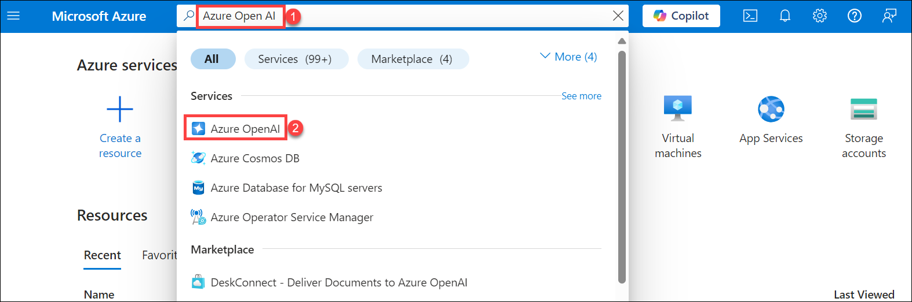

1. From the **Azure AI services | Azure OpenAI** pane, select **Copilot-OpenAI-<inject key="Deployment ID" enableCopy="false"/>**.

   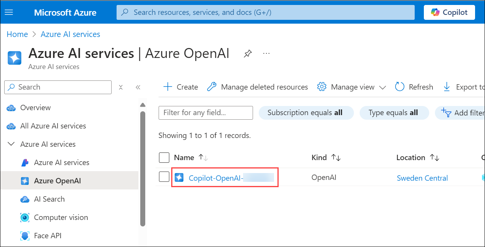

1. In the Azure OpenAI resource pane, select **Go to Azure OpenAI Studio**.

   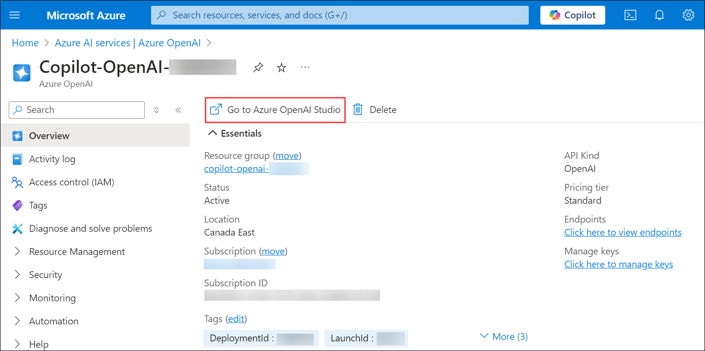
      
1. In the **Azure OpenAI Studio**, select **Deployments** under Management and verify that the **gpt-4** and **text-embedding-ada-002** models are present with the deployment names as **mygpt-4** and **ada-002**. Review that the model's capacity is set to **15K TPM**. Copy the Azure OpenAI deployment names and model names into the text file for later use.
   
   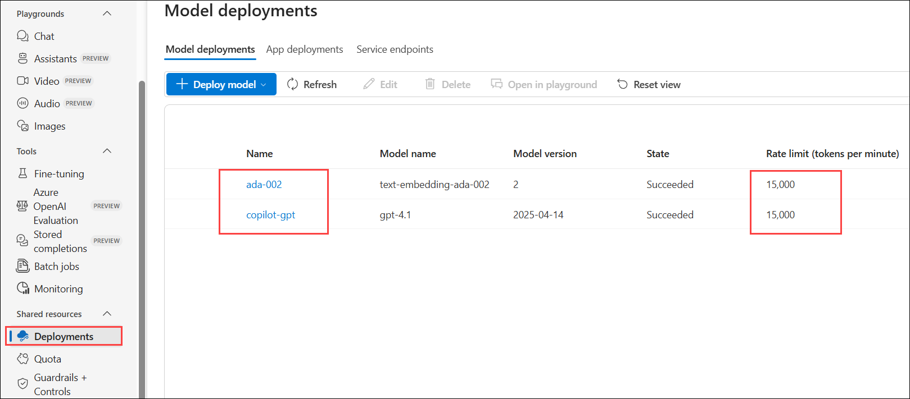

   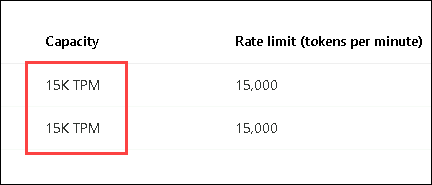

   >**Note:** Use bottom horizontal scroll bar to check the capacity value.

1. Navigate back to the Azure OpenAI resource on the **Azure portal**, select **Keys & Endpoint (1)** from the left menu, and click on **Show Keys (2)**. Copy the **KEY 1 (3)** and **Endpoint (4)**, and store them in a text file for later use.

   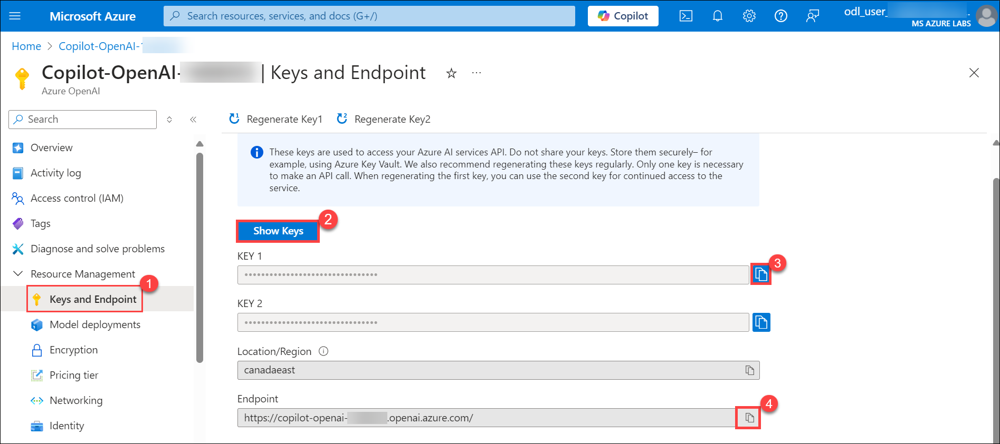
   
1. Navigate back to **Azure OpenAI**, select **AI search (1)** from the left menu, and click on **copilot-openai-<inject key="Deployment ID" enableCopy="false"/> (2)**.

   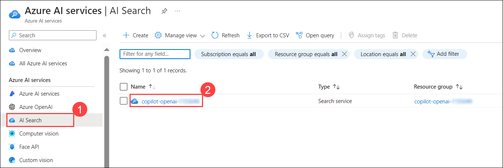

1. From the Overview tab of Cognitive Search, copy the **URL** and paste it into a text editor for later use.

   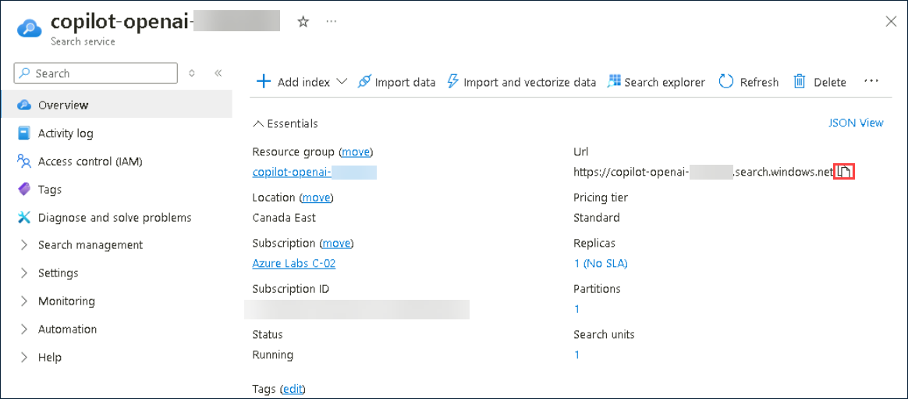

1. From the left menu, select **Key (1)**, copy the **Primary admin key (2)**, and paste it into a text editor for later use.

   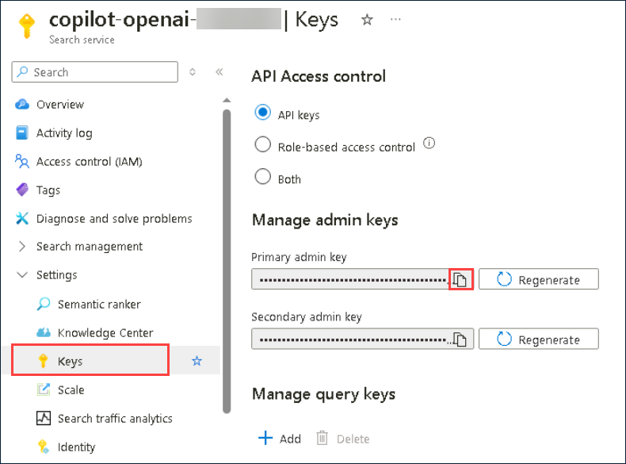

1. In the LabVM, open File Explorer, navigate to the below-mentioned path.

   ```
   C:\Labfiles\OpenAIWorkshop\scenarios\incubations\copilot
   ```
    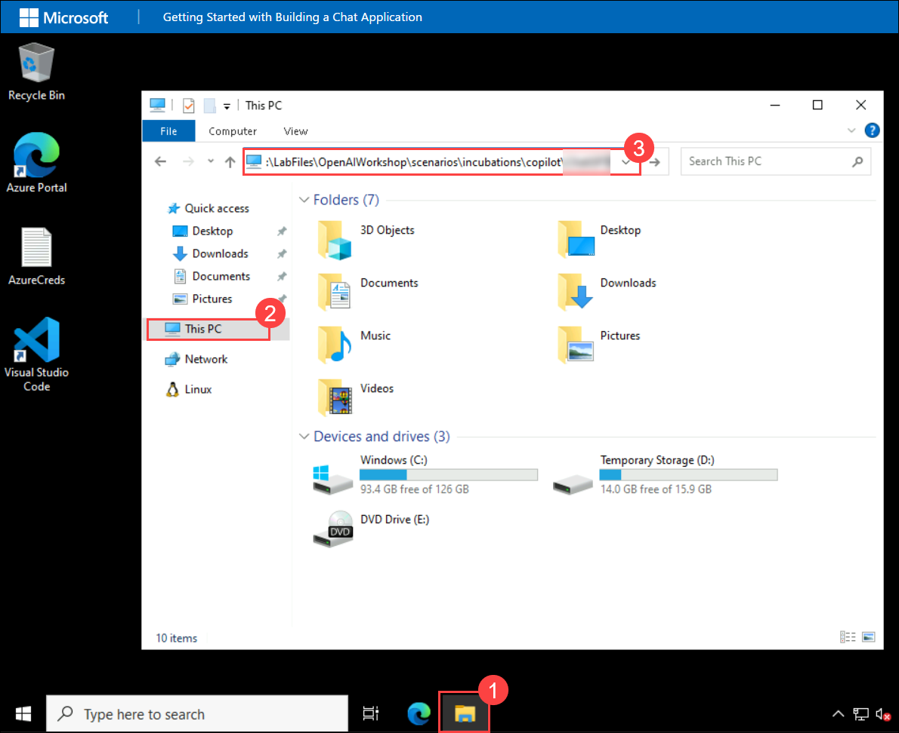

    **Right-click** on the `secrets.env` file, and select open with  **Visual Studio Code**.

    

1. The Visual Studio code is opened on the desktop. Edit the below code and update the **Azure OpenAI Key**, **Embedding Model name and GPT Deployment name**, **Azure OpenAI Endpoint**, **Cognitive Search Endpoint**, and **AZURE_SEARCH_ADMIN_KEY** values that you have copied and stored in the text file earlier.

    ```python
      AZURE_OPENAI_API_KEY = "YOUR_OPENAI_KEY" //#Replace it with the OpenAI key you copied in Task 1,Step 5.
    ```
    ```python
      AZURE_OPENAI_ENDPOINT= "YOUR_OPENAI_ENDPOINT" //#Replace with the OpenAI Endpoint you copied in Task 1,Step 5.
    ```
    ```python
      AZURE_OPENAI_EMB_DEPLOYMENT = "ada-002" //#Replace with the embedding model deployment name you copied in Task 1,Step 4.
    ```
    ```python
      AZURE_OPENAI_CHAT_DEPLOYMENT= "copilot-gpt"  //#Replace with the gpt deployment name you copied in Task 1,Step 4.
    ```
    ```python
      AZURE_SEARCH_SERVICE_ENDPOINT="YOUR_SEARCH_SERVICE_ENDPOINT" //#Replace with Search Service Endpoint you copied in Task 1,Step 7.
    ```
    ```python  
      AZURE_SEARCH_ADMIN_KEY= "YOUR_SEARCH_SERVICE_ADMIN_KEY" //#Replace the value with the Primary admin key you copied in Task 1,Step 8.
    ```

1. After updating values, the `secrets.env` file should be as shown in the below screenshot. Press **CTRL + S** to save the file.

    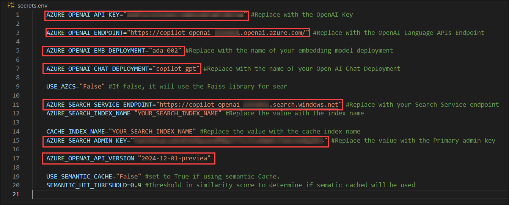

1. Next, click on the **Eclipse Button** on the top, then select **Terminal** and click on **New Terminal**.

     

1. Run the below command in the terminal to change the directory.

    ```powershell
    cd C:\Labfiles\OpenAIWorkshop\scenarios\incubations\copilot\employee_support
    ```
   
1. To execute the application, run the following command.

    ```python
    streamlit run hr_copilot.py
    ```

    > **Note**: You can enter your email address below to get notifications. If not, please leave this field blank and click on **Enter**.

1. Once the execution of `streamlit run hr_copilot.py` is completed, a locally hosted HR Copliot application will be opened in the web browser. 

    

    

1. Run the following query to validate the identity of the employee:

    ```
    John 1234
    ```

    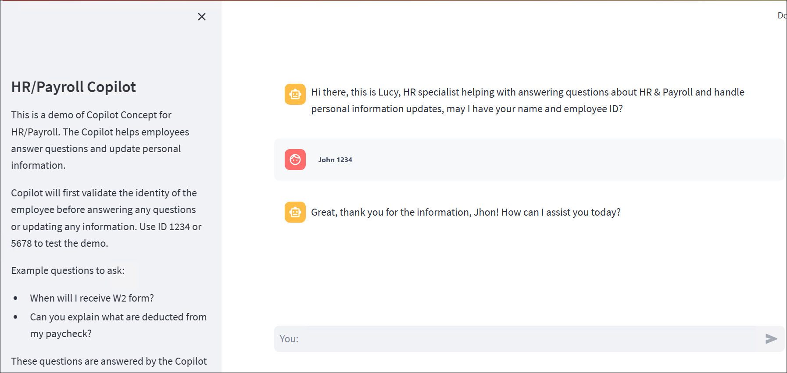

1. Enter an example question . The questions are answered by the Copilot by searching a knowledge base.

    ```
    When will I receive the W2 form?
    ```

    

1. Copilot can help update employee information, like address updates. For other information update requests, Copilot will log a ticket to the HR team to update the information. Enter:

    ```
    I moved to 123 Main St., San Jose, CA 95112, please update my address
    ```

    

#### Validation 

<validation step="bfc0e96d-c61e-4a91-b1ee-a10df581cdd5" />

>Once the validation is **succeeded**, navigate back to **CMD** and stop the terminal by typing **ctrl + C**.

### Task 2: Integrate Azure Cognitive Search with your Application

This task involves integrating Azure Cognitive Search with your HR/Payroll Copilot application. You'll set up data sources, configure the search index, and create vector profiles for enhanced search capabilities.

1. Navigate to **Azure AI services**, select **AI Search (1)** from the left menu, and click on **copilot-openai-<inject key="Deployment ID" enableCopy="false"/> (2)**.

   

1. On the **Overview (1)** page, click on **Import data (2)**.

    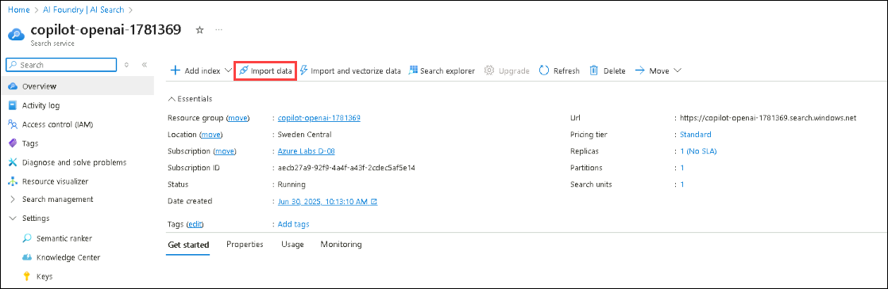

1. On the **Import data** page, under **Choose a data source**, select **Azure Blob Storage**.

    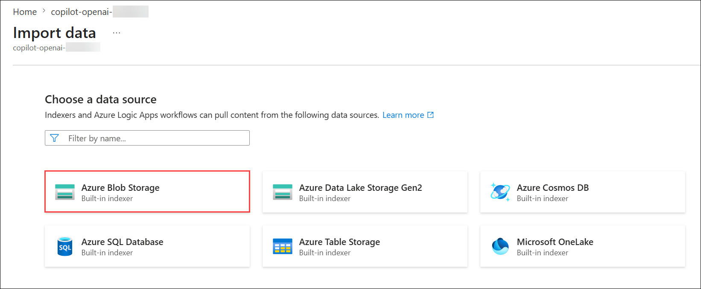

1. Under **What scenario are you targeting?**, select **RAG**.

    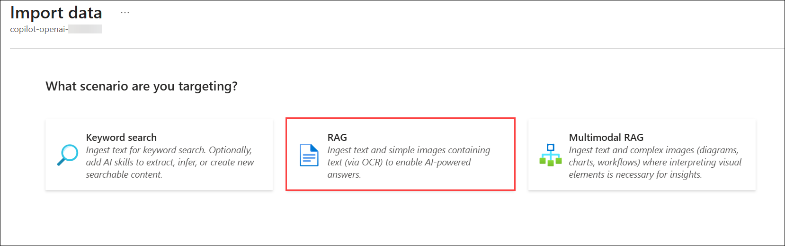

1. On the **Configure your Azure Blob Storage** page, configure the following details and then click on **Next (6)**.

    |Setting|Value|
    |---|---|
    |Subscription| Select the available subscription **(1)** |
    |Storage account| **copilotstorage<inject key="DeploymentID" enableCopy="false"></inject> (2)** |
    |Blob container| **data (3)** |
    |Blob folder| **data (4)** |
    |Parsing mode| **JSON array (5)** |

     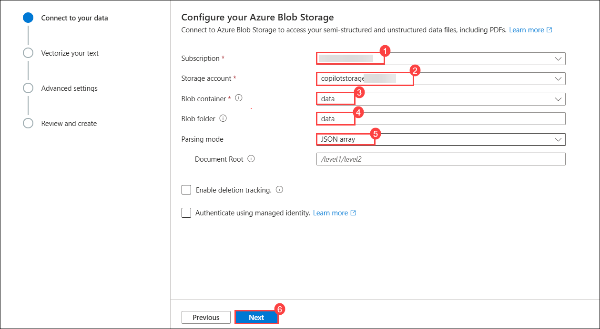

1. On the **Vectorize your text** page, configure the following settings and then click on **Next (8)**.

    |Setting|Value|
    |---|---|
    |Column to vectorize| **content (1)** |
    |Kind| **Azure OpenAI (2)** |
    |Subscription| Select the available subscription **(3)** |
    |Azure OpenAI service| **Copilot-OpenAI-<inject key="DeploymentID" enableCopy="false"></inject> (4)** |
    |Model deployment| **ada-002 (5)** |
    |Authentication type| **API key (6)** |

    > **Note:** Make sure the acknowledgment checkbox for Azure OpenAI additional costs is enabled **(7)**.

    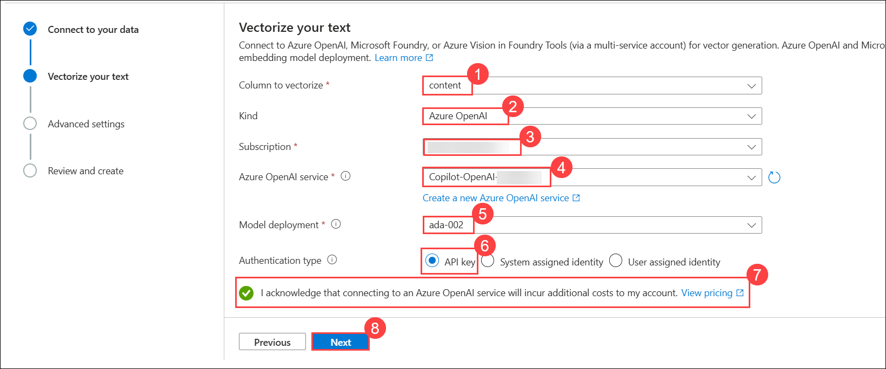

1. On the **Advanced ranking and relevancy** page, keep the default settings and click on **Next**.

    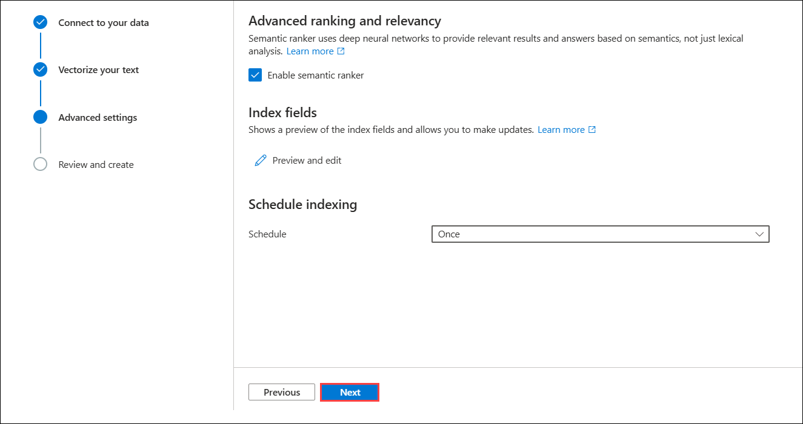

1. On the **Review and create** page, enter **payroll-hr (1)** under **Objects name prefix** and then click on **Create (2)**.

    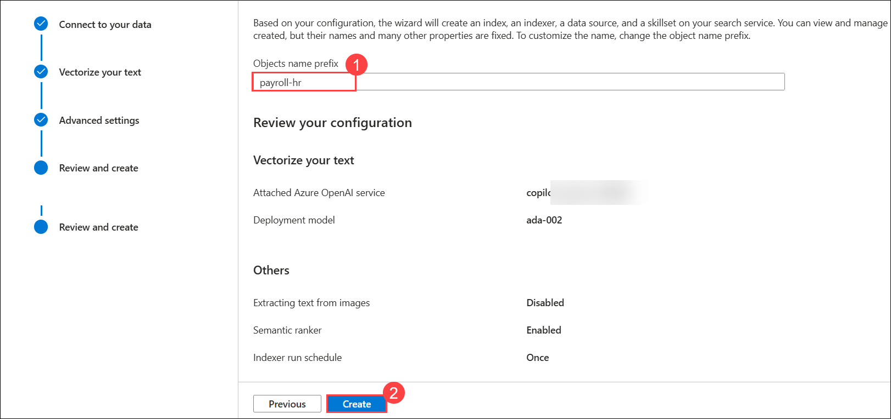

1. Repeat the previous steps to create another index. On the **Review and create** page, enter **payroll-hr-cache (1)** under **Objects name prefix** and then click on **Create (2)**.

    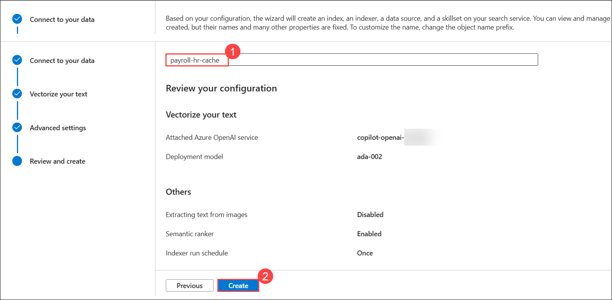

1. From the left navigation menu, expand **Search management (1)** and select **Indexes (2)**. Verify that both **payroll-hr** and **payroll-hr-cache** indexes are listed under the **Name (3)** section.

    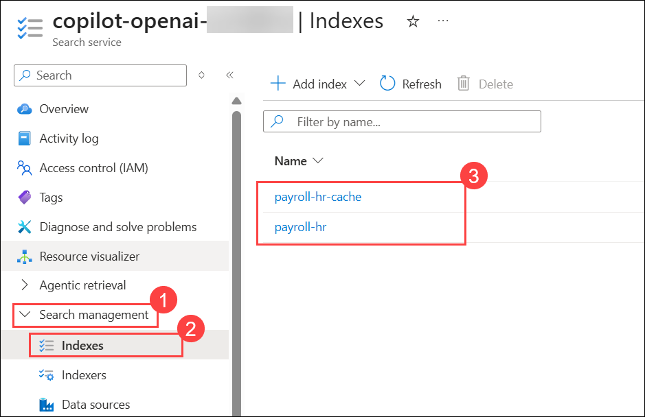


#### Validation

<validation step="4d8443a8-0de5-4a6c-ab23-621adb89ca44" />

### Task 3: Deploy the HR/Payroll Copilot application to Azure

In this task, you'll deploy the HR/Payroll Copilot application to Azure. You'll use a Bicep file to configure the necessary settings and then deploy the application using Azure Dev CLI commands.

1. In the LabVM, open File Explorer, navigate to the below-mentioned path, right-click on the `main.bicep` file, and select open with  **Visual Studio Code**.

      ```
      C:\LabFiles\OpenAIWorkshop\infra
      ```

    

1. In the **appsettings** section of the `main.bicep` file, replace the values below with the ones you copied previously in the text editor. Next, press **CTRL + S** to save the file.

    ```python
      AZURE_OPENAI_API_KEY = "YOUR_OPENAI_KEY" //#Replace it with the OpenAI key you copied in Task 1,Step 5.
    ```
    ```python
      AZURE_OPENAI_ENDPOINT= "YOUR_OPENAI_ENDPOINT" //#Replace with the OpenAI Endpoint you copied in Task 1,Step 5.
    ```
    ```python
      AZURE_OPENAI_EMB_DEPLOYMENT = "ada-002" //#Replace with the embedding model deployment name you copied in Task 1,Step 4.
    ```
    ```python
      AZURE_OPENAI_CHAT_DEPLOYMENT= "copilot-gpt"  //#Replace with the gpt deployment name you copied in Task 1,Step 4.
    ```
    ```python
      AZURE_SEARCH_SERVICE_ENDPOINT="YOUR_SEARCH_SERVICE_ENDPOINT" //#Replace with Search Service Endpoint you copied in Task 1,Step 7.
    ```
    ```python  
      AZURE_SEARCH_ADMIN_KEY= "YOUR_SEARCH_SERVICE_ADMIN_KEY" //#Replace the value with the Primary admin key you copied in Task 1,Step 8.
    ```

    The `appsettings` section should look like the below screenshot after you update the values.

     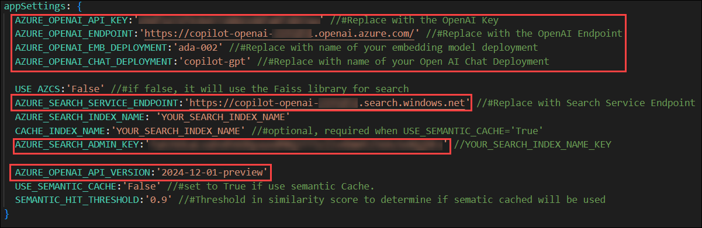

1. In the LabVM, navigate to Desktop and search for `cmd` in the search box, then click on **Command Prompt**.

     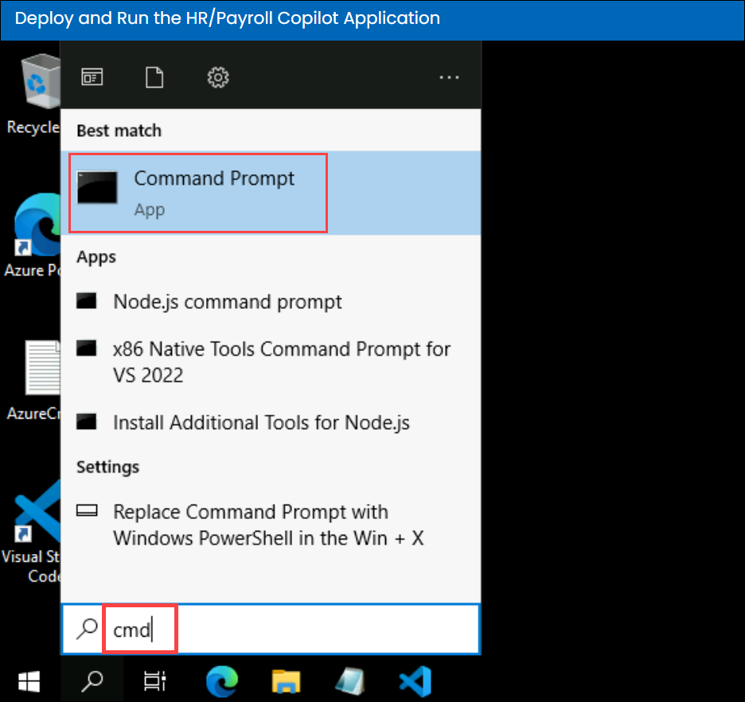

1. Run the below command to change the directory.

   ```bash
   cd C:\LabFiles\OpenAIWorkshop
   ```

1. Run the below command to **Authenticate with Azure**. It will redirect you to the Azure-authorized website. Next, select your account.

   ```bash
   azd auth login
   ```

1. Run the below command to set up the resource group deployment and **Create a new environment**. Make sure to replace `{DeploymentId}` with **<inject key="Deployment ID" enableCopy="true"/>** in the below command.

   ```bash
   azd config set alpha.resourceGroupDeployments on
   ```
   
   ```bash
   azd env new copilot-{DeploymentId}
   ```

1. Run the below command to provision Azure resources and deploy your project with a single command.

   ```bash
   azd up
   ```
   
1. Please select your Azure subscription to use, enter `1`, and click on the **Enter** button.

   

1. Please select an Azure location to use, select the location as **<inject key="Region" enableCopy="false"/>** location, and click on the **Enter** button. You can change the location using the up and down arrows.

    

1. Next, select **copilot-openai-<inject key="Deployment ID" enableCopy="False"/>** resource group and hit **ENTER**.

    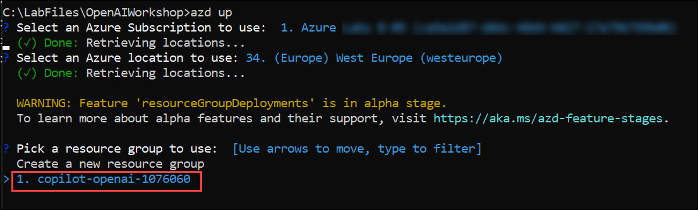

1. Once the deployment succeeds, you will see the following message **SUCCESS: Your application was provisioned and deployed to Azure**. The deployment might take 5-10 minutes. It produces a web package file, then creates the resource and publishes the package for the app service.

    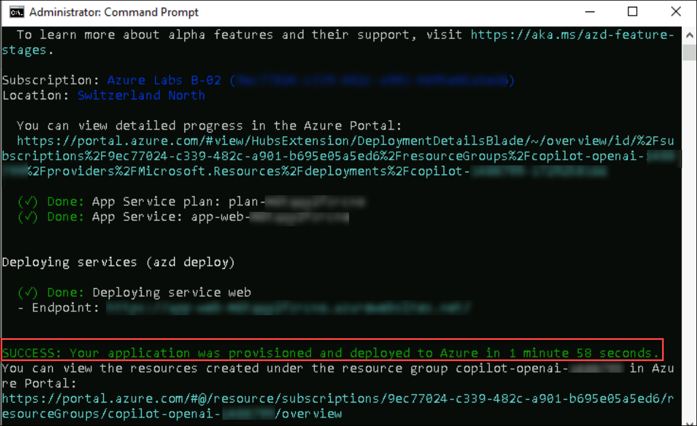

1. Navigate back to the Azure portal, search, and select **App service**. Select the available web app that you have deployed in the previous step.

    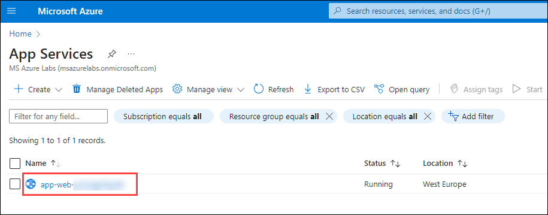

1. Next, click on **Browse** to open your Web application.

    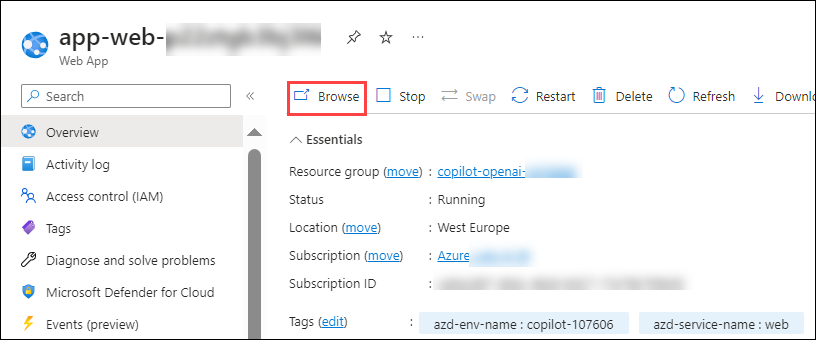

    

    > **Note**: If an issue occurs when you try to launch the app service, please restart the app service and wait five minutes before trying to launch the app again.
       

    > i. Even after 10 minutes of restarting the app service, the webpage still shows the error. Return to the **command prompt(cmd)**, press **Ctrl+C** to stop, and execute the below command. 

      ```
      azd up
      ```
      
      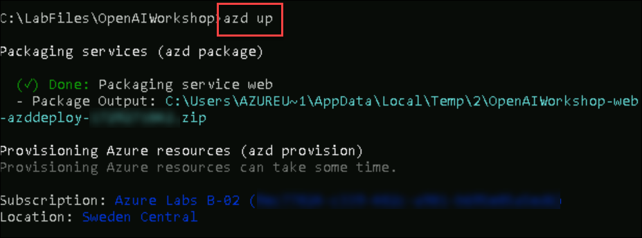

    > ii. Now follow steps 12 and 13 of Task 3, and you should see the webpage where you can interact with the chatbot."

      

1. Run the following query to validate the identity of the employee:

    ```
    John 1234
    ```

    
    
1. Enter an example question . The questions are answered by the Copilot by searching a knowledge base.

    ```
    When will I receive the W2 form?
    ```

    

1. Copilot can help update employee information, like address updates. For other information update requests, Copilot will log a ticket to the HR team to update the information. Enter:

    ```
    I moved to 123 Main St., San Jose, CA 95112, please update my address
    ```

    

#### Validation

<validation step="de89d182-5c32-4a80-b44c-8fd6c706fdbe" />

## Summary

In this lab, you have accomplished the following:

- Built and configured the HR/Payroll Copilot application locally.
- Integrated Azure Cognitive Search to enhance search functionality within the application.
- Successfully deployed the application to Azure, making it accessible as a web service.

### You have successfully completed the lab